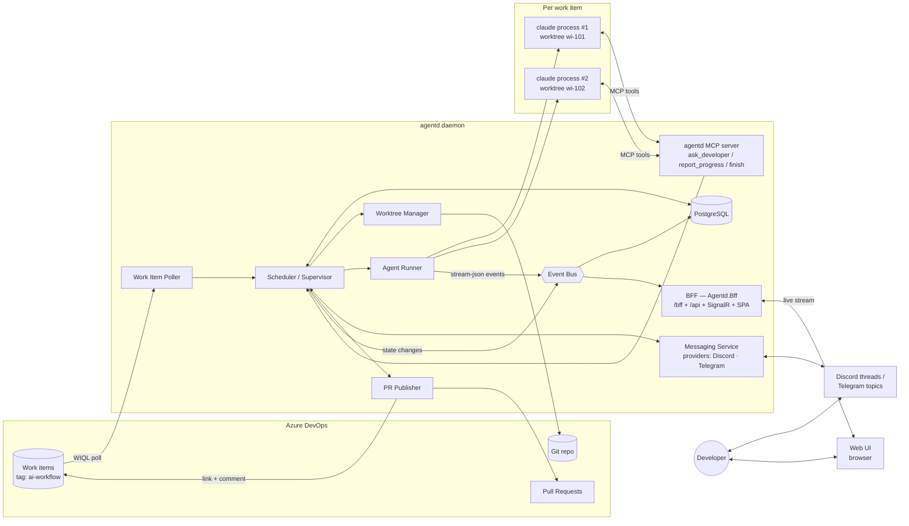
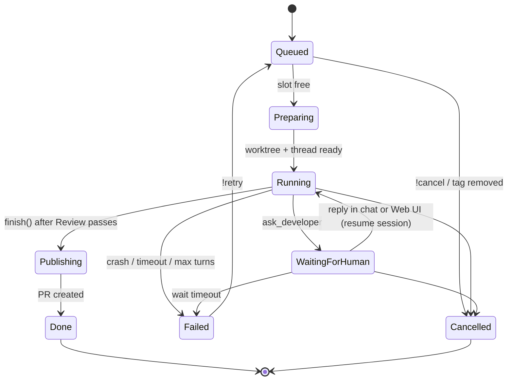
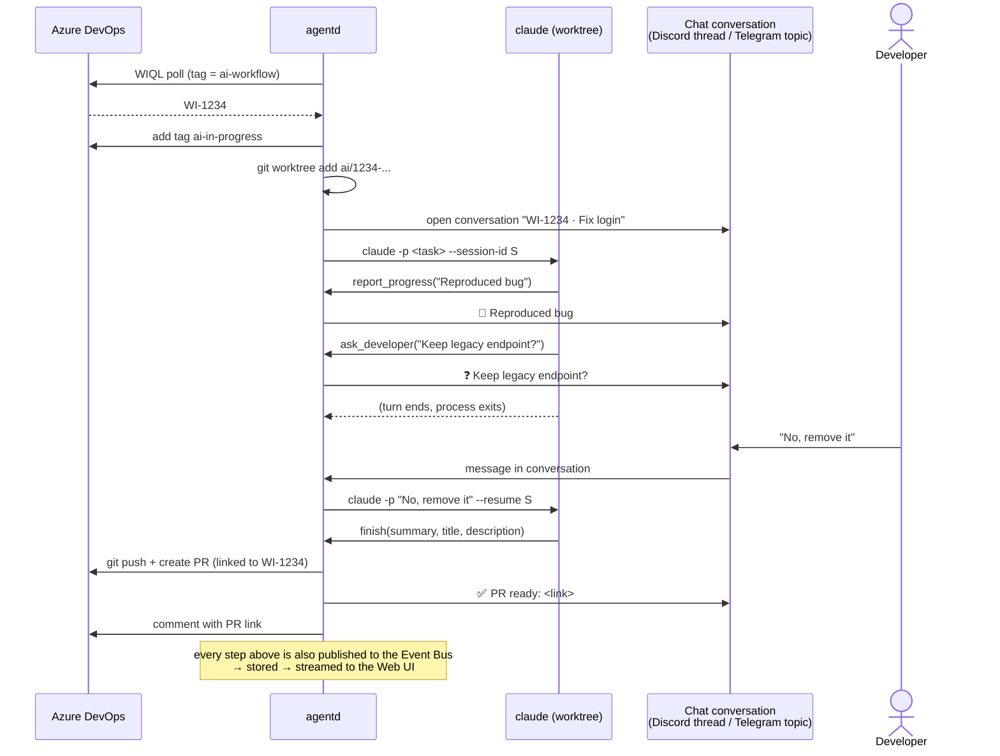

# agentd — Architecture

`agentd` is a long-running background daemon that picks up Azure DevOps work items tagged
for AI, runs one Claude Code agent per work item in its own git worktree, talks to the
developer through chat (Discord, Telegram, … via **messaging providers**), and opens a Pull
Request when the work is done.

Chat is the main channel for conversation: every question, progress update, approval and final
result flows through a conversation dedicated to that work item. That is a thread on Discord or a
forum topic on Telegram, and more platforms can be added as providers
([messaging-providers.md](messaging-providers.md)). A **Web UI** gives a
real-time view of every session: live transcripts, tool calls, state and cost.

---

## 1. Goals and non-goals

**Goals**

- Poll Azure DevOps for work items carrying a configurable tag (default `ai-workflow`).
- Authenticate with either the **Azure CLI** (`az login`) or a **Personal Access Token**.
- Run **multiple agents concurrently**, each isolated in its own **git worktree**, with its
  own **Claude Code process and session**.
- Route agent ↔ developer conversation through **one chat conversation per work item**, using
  **pluggable messaging providers** (Discord and Telegram first).
- On completion, **push the branch, create a PR** linked to the work item, and announce it
  in chat.
- **Keep PRs moving after they open.** PR Reviewer runs the repo's predefined reviewers on any open
  PR, PR Monitor keeps fixing review comments, CI failures and conflicts, and hotfixes get an
  expedited flow with an automatic backport ([pr-reviewer-and-monitor.md](pr-reviewer-and-monitor.md)).
- Run every job through a fixed workflow: **Design → Plan → Implement → Test → Review**,
  with optional human gates ([workflow-and-learning.md](workflow-and-learning.md)).
- **Initialize an ai-sdlc kit (`.agentd/`) in every repo**: phase instructions, templates,
  review checklist, context and verify commands. The team owns and customizes it
  ([ai-sdlc-kit.md](ai-sdlc-kit.md)).
- **Learn from every run.** Distill the lessons into a reviewed `learnings.md` per repository,
  which feeds future runs.
- Run **each phase on a configurable model profile** (Claude subscriptions or API keys, DeepSeek,
  GLM, Gemini, …) with fallbacks and per-profile cost tracking ([model-profiles.md](model-profiles.md)).
- Survive daemon restarts without losing jobs or Claude sessions.
- Provide a **Web UI to trace every session in real time**, including past sessions.

**Non-goals (v1)**

- The Web UI observes and controls agents; it does not replace chat for conversation.
- No auto-merge. A human always reviews and merges the PR.
- No multi-host scheduling; one daemon per machine.

---

## 2. High-level view



### 2.1 Tech stack

| Concern | Choice |
|---|---|
| Runtime | **.NET 10** (LTS). One ASP.NET Core process that hosts everything. |
| Architecture | **Clean Architecture** (Domain → Application → Infrastructure / Presentation) with a **BFF** for the browser. See §2.2. |
| Hosting | Generic Host; the timer-driven workers (poller, scheduler, retention) are `BackgroundService`s in the composition root. It runs as a systemd unit (`Microsoft.Extensions.Hosting.Systemd`) or a Windows Service. |
| Database | **PostgreSQL 16+** via **EF Core + Npgsql**, with migrations checked in |
| Azure DevOps auth | `Azure.Identity` → `AzureCliCredential` (az cli mode) or PAT; both behind `IAzureDevOpsTokenProvider` |
| Azure DevOps API | typed `HttpClient` against the REST API (`api-version=7.1`), with Polly resilience via `Microsoft.Extensions.Http.Resilience` |
| Claude processes | `System.Diagnostics.Process` (or CliWrap) running the `claude` CLI, with stream-json read line by line from stdout |
| MCP server (agent → daemon) | official C# MCP SDK (`ModelContextProtocol.AspNetCore`), mapped at `/mcp` on the same host |
| Messaging | Provider pattern ([messaging-providers.md](messaging-providers.md)): **Discord.Net** (Discord), **Telegram.Bot** (Telegram) |
| Real-time to browser | **SignalR** hub (WebSockets, with automatic fallback) |
| Web UI | **Vue 3 + TypeScript + Vite**, Pinia stores, **daisyUI** on Tailwind CSS, headless parts from **base-ui-vue**. See §3.9, [docs/ui](../ui/README.md) and [docs/design-system](../design-system/README.md). |
| Orchestration | **Microsoft Agent Framework** Workflows for the phase pipeline, gates and checkpoints; MAF agents for non-coding LLM steps; Claude Code CLI for coding ([orchestration-maf.md](orchestration-maf.md)) |
| In-process event bus | `System.Threading.Channels` + PostgreSQL `LISTEN/NOTIFY` |
| Logging / tracing | `ILogger` + OpenTelemetry (traces per job, metrics for cost and turns) |
| Local dev | **.NET Aspire** (AppHost: PostgreSQL + Host + Vite; ServiceDefaults: OTel, health checks). It is dev-time only; production runs the Host directly under systemd. |
| CI | **GitHub Actions** (.NET 10 SDK via `global.json`, **Node 24**, **npm**) |

### 2.2 Architecture style: Clean Architecture + BFF

- **Clean Architecture.**
  - `Agentd.Domain` holds the `Job` aggregate and its state machine.
  - `Agentd.Application` holds the use cases and the **ports** (`IWorkItemSource`, `IChatChannel`,
    `IAgentRunner`, `IWorktreeManager`, `IJobRepository`, `IEventStore`, …).
  - The `Agentd.Infrastructure.*` projects hold one adapter per external system (Persistence,
    AzureDevOps, Messaging.Discord, Messaging.Telegram, Claude, Git).
  - The presentation projects are the **driving adapters**: `Agentd.Bff` for the browser and
    `Agentd.Mcp` for the agents.
  - `Agentd.Host` is the composition root.
  - Dependencies point inward only, which is enforced by architecture tests.
- **BFF.**
  - The Vue SPA talks only to `Agentd.Bff`, on the same origin.
  - The BFF owns login (**SSO via Microsoft Entra ID or Google**, OIDC, server-side), the HttpOnly session cookie, antiforgery, CSP,
    the SignalR hub and **screen-shaped `/api` endpoints**.
  - No token ever reaches the browser, and ADO and chat bot credentials never leave the server.

Full design: **[clean-architecture-bff.md](clean-architecture-bff.md)**.

---

## 3. Components

### 3.1 Config

Standard .NET configuration: `appsettings.json` → `appsettings.{Environment}.json` → environment
variables → user-secrets in dev. Settings bind to strongly typed options classes (`IOptions<T>`)
and are validated at startup. Secrets are only supplied through env vars or a secret store, e.g.
`Agentd__AzureDevOps__Pat`, `Agentd__Messaging__Providers__Discord__BotToken`,
`Agentd__Messaging__Providers__Telegram__BotToken` and `ConnectionStrings__Agentd`.

```jsonc
{
  "ConnectionStrings": { "Agentd": "Host=localhost;Database=agentd;Username=agentd" },
  "Agentd": {
    "AzureDevOps": {
      "Organization": "https://dev.azure.com/my-org",
      "Project": "MyProject",
      "Auth": "AzCli",                 // AzCli | Pat
      "Tag": "ai-workflow",            // configurable trigger tag
      "ClaimTag": "ai-in-progress",    // added when a job is picked up
      "States": ["New", "Active"],
      "PollInterval": "00:01:00"
    },
    "Repositories": [
      {
        "Name": "agentd",
        "LocalPath": "/home/ulab/tngo/github/agentd",
        "Remote": "origin",
        "BaseBranch": "main",
        "Match": { "AreaPath": "MyProject\\Platform" },  // or a tag like repo:agentd
        "RequireKit": true,                              // job waits until .agentd/ kit exists & validates
        "Limits": { "AllowedProfiles": ["claude-max-1", "claude-api", "glm-flash"], "MaxTurns": 200 }
        // team-owned settings (verify, gates, model prefs, messaging) live in the repo's .agentd/kit.json
      }
    ],
    "Agents": {
      "MaxConcurrent": 3,
      "WorktreeRoot": "~/.agentd/worktrees",
      "BranchPrefix": "ai/",
      "Claude": {
        "Binary": "claude",
        // model and credentials come from Models:Profiles + Models:Routing (model-profiles.md)
        "PermissionMode": "acceptEdits",
        "AllowedTools": ["Read", "Edit", "Write", "Bash(git:*)", "Bash(dotnet test:*)"],
        "MaxTurns": 200,
        "IdleTimeout": "00:30:00",         // kill a hung process
        "WaitForHumanTimeout": "3.00:00:00" // give up waiting for an answer
      }
    },
    "Users": [                         // one directory for web SSO + chat (security/authentication.md §4)
      { "Name": "tngo", "Email": "tngo@example.com", "Roles": ["Admin"],
        "Identities": { "Discord": "789...", "Telegram": "123456789", "AzureDevOps": "tngo@example.com" } }
    ],
    "Auth": {                          // security/authentication.md §6
      "Mode": "Sso",                   // None (loopback only) | Sso
      "Providers": { "Microsoft": { "Enabled": true, "TenantId": "…", "ClientId": "…" },
                     "Google":    { "Enabled": true, "ClientId": "…", "AllowedHostedDomains": ["example.com"] } }
    },
    "Messaging": {                     // see messaging-providers.md §6
      "DefaultProviders": ["discord"],
      "Providers": {
        "Discord":  { "Enabled": true, "GuildId": "123...", "ChannelId": "456..." },
        "Telegram": { "Enabled": true, "ChatId": "-1001234567890", "Mode": "LongPolling" }
      }
    },
    "Web": {
      "Urls": "http://127.0.0.1:7780",
      "EventRetentionDays": 30
    }
  }
}
```

### 3.2 Azure DevOps client (auth + work items)

Two interchangeable auth providers sit behind one interface, `IAzureDevOpsTokenProvider`. A
`DelegatingHandler` stamps the header onto every request:

| Mode    | How                                                                                           | Header                              |
|---------|-----------------------------------------------------------------------------------------------|-------------------------------------|
| `AzCli` | `new AzureCliCredential().GetTokenAsync(new(["499b84ac-1321-427f-aa17-267ca6975798/.default"]))` (cached until `ExpiresOn`) | `Authorization: Bearer <token>`     |
| `Pat`   | PAT from configuration or env                                                                 | `Authorization: Basic base64(":" + PAT)` |

The operations it needs:

- **Query**: WIQL, e.g.
  `SELECT [System.Id] FROM WorkItems WHERE [System.TeamProject] = @project AND [System.Tags] CONTAINS 'ai-workflow' AND [System.Tags] NOT CONTAINS 'ai-in-progress' AND [System.State] IN ('New','Active')`
- **Read**: fetch the title, description, acceptance criteria, repro steps, comments and attachments.
- **Claim**: add `claimTag` (JSON Patch) so other daemons and later polls skip the item, then post a
  comment linking to the job's chat conversation(s).
- **Complete**: add a comment with the PR link, then optionally move the state (for example to `Resolved`).

See [references/azure-devops.md](references/azure-devops.md).

### 3.3 Work Item Poller

- Runs every `pollIntervalSeconds`.
- Diffs results against the state store, and enqueues only items that are new and not yet claimed.
- If the trigger tag is removed from an item that has a running job, it asks the scheduler to cancel
  that job.

### 3.4 Scheduler / Supervisor (the core)

This component owns the **job state machine**, enforces `maxConcurrent`, and is the only component
that writes to the state store. The phase pipeline inside `Running` is executed by a **Microsoft
Agent Framework workflow** (checkpointed in PostgreSQL). The Domain `Job` stays the source of truth
([orchestration-maf.md](orchestration-maf.md)).



**Job record** (PostgreSQL `jobs` table, EF Core entity `Job`):

| field | purpose |
|---|---|
| `work_item_id` | primary key |
| `repo`, `branch`, `worktree_path` | workspace |
| `claude_session_id` | UUID passed to `claude --session-id`, reused with `--resume` |
| *(`conversations` table)* | one row per provider conversation (thread/topic) that routes chat messages to this job; see [messaging-providers.md §7](messaging-providers.md#7-persistence-domain--persistence) |
| `state`, `attempt`, `last_error` | lifecycle |
| `pr_url` | result |
| `created_at`, `updated_at` | timeouts and recovery |
| `xmin` (row version) | optimistic concurrency on state transitions |

**Dequeue.** `SELECT ... WHERE state = 'Queued' ORDER BY created_at FOR UPDATE SKIP LOCKED LIMIT 1`.
This works safely today, and it lets more than one daemon host share the queue later without
redesign.

**Recovery on restart**

- `Running` jobs whose process is gone → resume the same Claude session with the prompt
  *"agentd restarted; continue where you left off"*.
- `WaitingForHuman` → nothing to do; these jobs have no process attached.
- `Publishing` → the publish step is idempotent, so check whether the branch or PR already exists
  before creating it.

### 3.5 Worktree Manager

```bash
git -C <repo> fetch origin <baseBranch>
git -C <repo> worktree add <worktreeRoot>/<repo>/wi-<id> -b ai/<id>-<slug> origin/<baseBranch>
```

- There is one worktree per job, so agents never share files.
- After `Done` or `Cancelled`: `git worktree remove` (configurable — keep it for debugging).
- Run `git worktree prune` on startup.
- Optional per-repo setup hook (e.g. `dotnet restore`, `npm ci`) after creation.

### 3.6 Agent Runner (one Claude process per job)

`Running` is divided into the workflow phases **Design → Plan → Implement → Test → Review**
(see [workflow-and-learning.md](workflow-and-learning.md)). Each phase runs on the **model
profile** chosen by the routing rules, which can be a Claude subscription, an API key, DeepSeek,
GLM, Gemini or another provider (see [model-profiles.md](model-profiles.md)). The profile decides
the process environment (`ANTHROPIC_BASE_URL`, credential, model, `CLAUDE_CONFIG_DIR`). A session
is pinned to one profile, and switching profile starts a new session seeded with the phase artifacts.

Each job gets its **own `claude` process** running in its worktree, with a **session ID owned by
the daemon**:

```bash
# first run
claude -p "<task prompt>" \
  --session-id <uuid> \
  --output-format stream-json --verbose \
  --model <model> --permission-mode <mode> --allowedTools <...> --max-turns <n> \
  --mcp-config <job-mcp.json> \
  --append-system-prompt "<agentd rules>"
# cwd = worktree

# every later turn (developer reply, restart recovery)
claude -p "<developer reply>" --resume <uuid> ...same flags...
```

- The **task prompt** is built from the work item: the title, description, acceptance criteria and
  comments, the repo and branch, plus instructions to commit to the branch and call `finish` when
  done.
- **stdout (stream-json)** is parsed for tool use, cost and errors. Condensed progress is
  forwarded to chat (rate-limited), and the full log is written to
  `~/.agentd/logs/wi-<id>.jsonl`.
- **Environment:** the process gets its own `HOME`-independent env, with no ADO PAT or chat bot
  tokens. The agent never talks to chat platforms or ADO directly; it only calls the agentd MCP tools.

**Why the process exits while waiting for a human.** When the agent asks a question, its
turn ends and the process exits. The session lives on disk, so the reply resumes it with
`--resume`. This means:

- no idle processes hold memory for hours or days;
- a daemon restart loses nothing;
- concurrency slots count only *actively running* agents, so a job waiting on a person does not
  block other work.

### 3.7 agentd MCP server (agent → daemon channel)

The daemon hosts one MCP endpoint (`app.MapMcp("/mcp")` using the C# MCP SDK, HTTP transport). Each
Claude process receives it through `--mcp-config`, with a **per-job bearer token** so the daemon
knows which job is calling. It gives the
agent structured tools instead of the daemon having to parse free text:

| Tool | Effect |
|---|---|
| `ask_developer(question, options?)` | Posts the question to the job's chat conversation(s), with options rendered as buttons where supported, and sets the job to `WaitingForHuman`. The tool returns *"Question posted. End your turn now."* |
| `report_progress(message)` | Updates the status message in each conversation (edited in place where supported). |
| `complete_phase(phase, summary, artifact_markdown, applied_learnings[])` | Stores the phase artifact and advances the workflow (or opens a gate). |
| `record_learning(phase, kind, statement, evidence)` / `get_learnings(phase, paths?)` | Capture a candidate learning / fetch approved learnings ([workflow-and-learning.md](workflow-and-learning.md)). |
| `finish(summary, pr_title, pr_description)` | Marks the work complete (only after Review passes), and the daemon moves to `Publishing`. |
| `get_work_item()` | Re-reads the latest work item and its comments. |

### 3.8 Messaging (provider pattern)

Chat goes through the `IMessagingProvider` port, with one adapter per platform: **Discord** (a
thread per job) and **Telegram** (a forum topic per job). Everything that is not platform-specific
is written once in the Application layer:

- **Outbound (`MessagingService`):** routing to the job's providers, fan-out, chunking to each
  provider's length limit, editing progress messages in place, and a transactional outbox with retry.
- **Inbound (`HandleInboundMessage`):**
  - dedupe;
  - **per-provider user allowlist**, since developer text becomes prompt input;
  - routing by conversation → job;
  - provider-neutral commands: `status`, `cancel`, `retry`, `logs`, `pause`, and `list` / `run <id>`
    in the parent space.
- **Replies:** if a job is `WaitingForHuman`, a reply resumes the Claude session. If it is `Running`,
  the reply is queued as the next turn.
- **Multiple providers per job:** a job may be on several providers at once. Replies from any of
  them, or from the Web UI, are mirrored to the others.
- **Choosing providers:** by `Messaging:DefaultProviders`, per repo, or with a `chat:<provider>`
  work item tag.

Full design: **[messaging-providers.md](messaging-providers.md)**. Platform notes:
[Discord](references/discord.md) · [Telegram](references/telegram.md).

### 3.9 Event Bus and Web UI (real-time session tracing)

**Event Bus.** An in-process pub/sub built on `System.Threading.Channels`. Every observable fact becomes an event
`{seq, job_id, ts, type, payload}`:

| Source | Event types |
|---|---|
| Agent Runner (stream-json parser) | `assistant.text`, `tool.call`, `tool.result`, `turn.result` (turns, tokens, cost), `process.started` / `process.exited` |
| Scheduler | `job.state_changed`, `job.created`, `job.error` |
| Messaging Service | `message.outbound`, `message.inbound` (the developer's replies), each with a `provider` field |
| PR Publisher | `pr.pushed`, `pr.created`, `verify.output` |

Events are appended to the PostgreSQL `events` table **before** they are fanned out. The table uses
a `bigint identity` column for `seq`, a `jsonb` column for `payload`, an index on `(job_id, seq)`,
and monthly partitions so retention is a cheap `DROP PARTITION`. After each commit the daemon runs
`NOTIFY agentd_events, '<seq>'`, which keeps a future multi-instance setup (or a separate UI
process) in sync. As a result, the UI can always replay history and then follow the live stream
without gaps.

**UI technology: Vue 3 + daisyUI, with base-ui-vue primitives.** The UI is a single-page app in
`web/`, built with Vite and served as static files by the daemon. It keeps runtime dependencies
deliberately small: **no data-fetching, caching or virtualization libraries** (no TanStack etc.).

| Concern | Choice |
|---|---|
| Framework | Vue 3 (Composition API, `<script setup>`) + TypeScript, built with Vite |
| Routing | Vue Router |
| State + server data | **Plain Pinia setup stores.** Each store owns its own `fetch` calls, loading/error flags and live-event merging. No query cache library. |
| HTTP | a thin typed `fetch` wrapper (`web/src/api/http.ts`) |
| Live events | `@microsoft/signalr` client, owned by one `connection` store; events are routed into the `jobs` and `events` stores |
| Styling | **daisyUI 5** on Tailwind CSS 4, with a custom green `agentd` theme (the Vue green `#42b883`) in light and dark variants |
| Interactive primitives | **base-ui-vue** ([baseui-vue.com](https://baseui-vue.com)): unstyled, accessible parts (Collapsible, Tabs, Tooltip, Scroll Area, Switch, Toggle Group, Progress, Meter), styled with daisyUI/Tailwind classes via the `class` prop and `data-*` state attributes |
| Long transcripts | windowing: render the latest N events, with "load earlier" paging through `?before=<seq>`. No virtual-list library. |
| Diffs | a small in-house unified-diff parser plus the `DiffView` component |
| API types | `openapi-typescript` (**dev-time codegen only**, zero runtime) generates TS types from the ASP.NET Core OpenAPI document |

Screens, stores and components are specified in **[docs/ui](../ui/README.md)**. Colors, tokens
and component styling rules are in **[docs/design-system](../design-system/README.md)**.

**Live update flow:**

1. When a page opens, the `events` store loads history with `GET /api/jobs/{id}/events`, which gives `lastSeq`.
2. It connects to the SignalR hub and calls `Subscribe(jobId, lastSeq)`. The hub first replays any
   events after `lastSeq`, then streams live events.
3. After a reconnect (SignalR `withAutomaticReconnect()`), the page subscribes again with its latest
   `seq`, so no events are lost or duplicated. The client de-duplicates by `seq`.

**Serving:**

- **Production:** `npm run build` writes to `src/Agentd.Host/wwwroot/`, and the host serves it with
  `MapStaticAssets()` plus `MapFallbackToFile("index.html")` for client-side routes. It is still one
  deployable.
- **Development:** the Vite dev server (`npm run dev`) proxies `/bff`, `/api`, `/hubs` and `/healthz` to the
  daemon, which gives hot reload without CORS.

**BFF endpoints** (`Agentd.Bff`, in the same host, bound to `127.0.0.1` by default; see [clean-architecture-bff.md §5.1](clean-architecture-bff.md#51-agentdbff-backend-for-frontend-browser)):

| Endpoint | Purpose |
|---|---|
| `/` (static SPA) | Vue app: Dashboard, Session trace, Diff, History pages |
| `GET /bff/login?provider=microsoft\|google&returnUrl=` / `POST /bff/logout` / `GET /bff/user` / `GET /bff/providers` | server-side OIDC SSO session (HttpOnly cookie); see [authentication.md](../security/authentication.md) |
| `GET /bff/antiforgery` | issues the antiforgery request token in the response body; the cookie half is HttpOnly ([Security §2](../security/README.md#2-cookies-and-antiforgery)) |
| `GET /api/dashboard` | screen-shaped: stats + active jobs in one call |
| `GET /api/history?state=&repo=&q=&page=` | finished, failed and cancelled jobs, paged |
| `GET /api/jobs/{id}` | job detail, including links to the work item, chat conversations and PR |
| `GET /api/jobs/{id}/events?after=<seq>` / `?before=<seq>&limit=<n>` | paged history: replay forward, or page back for "load earlier" |
| SignalR `/hubs/events` → `Subscribe(jobId?, afterSeq)` | live events for the Vue UI; replays from `afterSeq` after a reconnect |
| `GET /api/jobs/{id}/diff` | `git diff <base>...HEAD` for the worktree |
| `POST /api/jobs/{id}/cancel` / `retry` / `messages` | same controls as the chat commands; a message is recorded and mirrored to all of the job's chat conversations so every channel keeps one history |
| `POST /api/workitems/{id}/run` | start a work item immediately |
| `GET /api/prs?repo=&filter=` / `GET /api/prs/{repo}/{id}` | PR dashboard: open PRs with CI, votes, conflicts, threads, agentd status |
| `POST /api/prs/{repo}/{id}/reviews` `{ reviewers[], post }` / `…/fix` `{ instruction? }` / `…/monitor` `{ enabled }` | run predefined reviewers, fix now, toggle monitoring (Operator) |
| `GET /api/repos/{repo}/reviewers` / `POST /api/hotfixes` | reviewer catalog from the kit / start a hotfix (Operator) |
| `/mcp` | `Agentd.Mcp`, not the BFF: the MCP endpoint for Claude processes (per-job token, not browser-facing) |
| `/healthz` | health checks (Postgres, each messaging provider, Azure DevOps token) |

**Web UI screens:**

1. **Dashboard:** a live table of all jobs, with state badges, running/waiting counts, concurrency
   slots in use, and today's cost.
2. **Session trace:** a live transcript of one job, with the assistant's text, collapsible
   tool calls and results (Bash output, file edits), questions and replies, and state transitions
   on a timeline. It auto-scrolls, virtualizes long sessions, and has filters by event type.
3. **Diff view:** the current branch diff in the worktree, refreshed on `tool.result` events for
   Edit/Write.
4. **History:** finished and failed jobs, with the full replay, PR link and cost.

**Auth.** The server listens on localhost only by default. Remote access goes through a reverse
proxy or a tunnel (e.g. Tailscale or Cloudflare Access), with **SSO through Microsoft Entra ID or
Google** (OIDC code flow + PKCE, run by the BFF) and a cookie session. Access is limited to the user
directory, and role policies apply: Viewer, Operator, Admin
([authentication.md](../security/authentication.md)). The SPA and API share one origin, so the
cookie covers the REST calls and the SignalR connection alike, with no tokens stored in the browser. Secrets and env are redacted from events before they are stored.

### 3.10 PR Publisher

1. Check that the worktree has commits ahead of the base. If there are none, report that in chat and stop.
2. Re-run the verify commands as a final guard. The real test loop happens in the **Test** phase, and
   review in the **Review** phase, both before `finish`.
3. `git push -u origin ai/<id>-<slug>`.
4. Create the PR with the ADO REST API (or `az repos pr create`), passing the source and target
   branches, the title and description from `finish()`, and `workItemRefs: [{id}]` so the work item
   is linked.
5. Post the PR link to the job's chat conversations and as a comment on the work item.
6. Optional: when the PR later gets review comments, feed them back into the same session.

---

## 4. End-to-end sequence



---

## 5. Security considerations

- **Secrets:** the PAT and the chat bot tokens come only from env vars or a secret store. Neither
  is ever passed to Claude processes.
- **Least-privilege PAT:** Work Items (Read & Write) and Code (Read & Write). Prefer `azcli`
  auth with a scoped identity where possible.
- **Prompt injection:** work item text and chat messages are untrusted input. Mitigations:
  - allowlist the chat users (per provider) who can steer agents;
  - restrict Claude's tools with `--allowedTools` and `permissionMode`, and never use
    `bypassPermissions` outside a sandbox or container;
  - keep network access for agents minimal.
- **Isolation:** worktrees isolate files but not the host. For stronger isolation, run each
  agent in a container or devcontainer that has the worktree mounted.
- **Human gate:** agents never merge; PRs go through normal review and branch policies.
- **Web UI / API:** HttpOnly-only cookies, antiforgery on every unsafe `/api` request, a strict CSP
  with no inline or eval'd script, and an Origin check on the SignalR hub. See
  **[docs/security](../security/README.md)**.

---

## 6. Observability

- The Web UI (§3.9) is the main observability surface: live and replayable traces for every session.
- Structured daemon logs, plus a per-job `stream-json` transcript.
- The `status` chat command shows: state, elapsed time, turns, token and cost totals, and the
  last tool used.
- Daily summary message in the parent channel (optional).

---

## 7. Proposed project layout

```
agentd/
├── Agentd.slnx
├── src/
│   ├── Agentd.Domain/                      # Job aggregate, state machine, value objects, domain events (BCL only)
│   ├── Agentd.Application/                 # use cases (commands/queries), ports, read models, Result<T>
│   ├── Agentd.Infrastructure.Persistence/  # EF Core + Npgsql, migrations, repositories, event store, NOTIFY
│   ├── Agentd.Infrastructure.AzureDevOps/  # token providers, WIQL/work items/comments/PR HTTP clients
│   ├── Agentd.Infrastructure.Messaging.Discord/   # IMessagingProvider: Discord.Net, threads, slash commands
│   ├── Agentd.Infrastructure.Messaging.Telegram/  # IMessagingProvider: Telegram.Bot, forum topics, long polling
│   ├── Agentd.Infrastructure.Claude/       # claude process runner, stream-json parser
│   ├── Agentd.Infrastructure.Git/          # worktrees, push, diff
│   ├── Agentd.Infrastructure.Orchestration/ # MAF workflows, executors, checkpoint store, MAF agents
│   ├── Agentd.Bff/                         # BFF: /bff session endpoints, /api view models, SignalR hub,
│   │                                       #      auth, antiforgery, CSP/security headers, SPA fallback
│   ├── Agentd.Mcp/                         # MCP tools → Application commands (per-job bearer auth)
│   ├── Agentd.Host/                        # composition root: Program.cs, workers, appsettings, wwwroot/
│   ├── Agentd.AppHost/                     # .NET Aspire: local orchestration (PostgreSQL, Host, Vite)
│   └── Agentd.ServiceDefaults/             # Aspire service defaults: OTel, health checks, resilience
├── web/                                    # Vue 3 + Vite + daisyUI (Tailwind) SPA → talks only to the BFF
│   ├── src/
│   │   ├── api/                # http.ts (fetch wrapper + antiforgery), generated OpenAPI types, hub.ts
│   │   ├── stores/             # Pinia: session, connection, jobs, events, ui
│   │   ├── components/ui/      # reusable AgButton, AgCollapsible, AgTabs... (base-ui-vue + daisyUI)
│   │   ├── components/         # feature components: EventItem, ToolCallCard, StateBadge, DiffView
│   │   ├── views/              # Dashboard, SessionTrace, History, Settings
│   │   └── styles/app.css      # Tailwind + daisyUI + agentd theme
│   └── vite.config.ts          # dev proxy → daemon; build output → src/Agentd.Host/wwwroot
├── tests/
│   ├── Agentd.Domain.Tests/
│   ├── Agentd.Application.Tests/
│   ├── Agentd.Infrastructure.Tests/        # Testcontainers for PostgreSQL, recorded fixtures
│   ├── Agentd.Bff.Tests/                   # WebApplicationFactory: auth, antiforgery, CSP
│   └── Agentd.ArchitectureTests/           # dependency rule
├── kit/                                    # default ai-sdlc kit shipped to repos (kit/v1/**, kit/schema/)
├── deploy/
│   └── agentd.service          # systemd unit
└── docs/
    ├── architect/  ui/  design-system/  security/
```

---

## 8. Open decisions

| # | Question | Leaning |
|---|---|---|
| 1 | ~~Language / DB~~ | **Decided:** .NET 10 + PostgreSQL |
| 2 | Spawn the `claude` CLI vs use an Agent SDK | CLI: it gives each job its own process, and the Agent SDKs target TypeScript/Python, not .NET |
| 3 | Where the code lives: Azure Repos only, or also GitHub | Azure Repos first; `IPullRequestService` is a port, so GitHub is another adapter |
| 4 | How a work item maps to a repo | area path or `repo:<name>` tag |
| 5 | Container sandbox per agent in v1? | Worktree only in v1; containers in v2 |
| 6 | ~~Web UI framework~~ | **Decided:** Vue 3 + Pinia + daisyUI + base-ui-vue (§3.9) |
| 7 | Discord library: Discord.Net vs NetCord | Discord.Net (mature, widely used); NetCord if newer Discord features are needed. It stays swappable inside the provider. |
| 12 | ~~Workflow~~ | **Decided:** Design → Plan → Implement → Test → Review + learning loop ([workflow-and-learning.md](workflow-and-learning.md)) |
| 13 | ~~Models~~ | **Decided:** per-phase model profiles with fallback chains ([model-profiles.md](model-profiles.md)) |
| 17 | ~~PR lifecycle~~ | **Decided:** PR Reviewer (kit-defined reviewers), PR Monitor (fix rounds, no force-push), hotfix + backport ([pr-reviewer-and-monitor.md](pr-reviewer-and-monitor.md)) |
| 16 | ~~Orchestration framework~~ | **Decided:** Microsoft Agent Framework Workflows + MAF agents for non-coding steps; Claude Code stays the coding runner; MAF Harness Agent is benchmark-gated ([orchestration-maf.md](orchestration-maf.md)) |
| 15 | ~~Per-repo process knowledge~~ | **Decided:** ai-sdlc kit in `.agentd/`, initialized by agentd and owned by the team ([ai-sdlc-kit.md](ai-sdlc-kit.md)) |
| 14 | Gemini integration | LiteLLM-style gateway via `ANTHROPIC_BASE_URL` first; a `GeminiCliRunner` only if tool-use quality needs it |
| 11 | ~~Chat platform~~ | **Decided:** provider pattern; Discord + Telegram first ([messaging-providers.md](messaging-providers.md)) |
| 8 | ~~Web UI auth~~ | **Decided:** OIDC SSO (Microsoft Entra ID, Google) through the BFF; `Mode: None` only on loopback ([authentication.md](../security/authentication.md)) |
| 9 | ~~Solution structure~~ | **Decided:** Clean Architecture + in-process BFF ([clean-architecture-bff.md](clean-architecture-bff.md)) |
| 10 | Split the BFF into its own process? | Not in v1; it depends only on Application ports, so it can be split later |

## 9. References

- **[../plan/README.md](../plan/README.md) — implementation plan: 11 phases, each reviewed before and after it is built**

- [clean-architecture-bff.md](clean-architecture-bff.md) — layers, use cases, ports, BFF responsibilities, tests
- [messaging-providers.md](messaging-providers.md) — chat provider pattern (Discord, Telegram, …)
- [workflow-and-learning.md](workflow-and-learning.md) — phases, gates, learnings capture → distill → review → apply
- [model-profiles.md](model-profiles.md) — per-phase model and provider routing, fallbacks, cost
- [ai-sdlc-kit.md](ai-sdlc-kit.md) — per-repo `.agentd/` kit: init, customize, upgrade, validate
- [orchestration-maf.md](orchestration-maf.md) — Microsoft Agent Framework workflow graph, checkpoints, MAF agents
- [pr-reviewer-and-monitor.md](pr-reviewer-and-monitor.md) — predefined PR reviewers, PR monitoring & fix rounds, hotfixes
- [references/azure-devops.md](references/azure-devops.md) — auth, WIQL, work item & PR REST calls
- [references/discord.md](references/discord.md) — bot setup, intents, threads
- [references/telegram.md](references/telegram.md) — bot setup, forum topics, long polling, inline keyboards
- [references/claude-code.md](references/claude-code.md) — headless CLI flags, sessions, MCP config
- [../ui/README.md](../ui/README.md) — Web UI screens, Pinia stores, components
- [../design-system/README.md](../design-system/README.md) — colors, theme, tokens, component styling
- [../security/README.md](../security/README.md) — antiforgery with HttpOnly cookies, CSP, security headers
- [../security/authentication.md](../security/authentication.md) — SSO (Microsoft Entra ID, Google), user directory, roles, sessions
