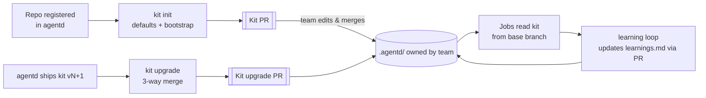

# agentd — The ai-sdlc kit (per repository)

Every repository agentd works on gets an **ai-sdlc kit**: a `.agentd/` folder that agentd
**initializes** with sensible defaults, and that the team then **owns and customizes** with their
own knowledge. The kit holds the phase instructions, artifact templates, review checklist, repo
context, verify commands and the repo's learnings. It is versioned in the repo, reviewed through
PRs like any other code, and read by agentd at the start of every job.

Related: [Workflow & Learning](workflow-and-learning.md) · [Model Profiles](model-profiles.md) ·
[Architecture](README.md)

---

## 1. Kit layout (in the target repo)

```
.agentd/
├── kit.json                 # kit version + repo settings (verify, gates, routing prefs, messaging, paths, pr, hotfix)
├── README.md                # what the kit is and how to customize it (for humans)
├── context.md               # repo knowledge: architecture, domain glossary, build/run, where things live
├── learnings.md             # distilled learnings (managed by the learning loop; human-editable)
├── phases/                  # phase instructions (the prompt for each phase)
│   ├── design.md
│   ├── plan.md
│   ├── implement.md
│   ├── test.md
│   ├── review.md
│   ├── pr-fix.md            # PR Monitor fix rounds: review threads, CI failures, conflicts
│   └── hotfix.md            # expedited fix on a release branch
├── templates/               # required structure of each phase artifact
│   ├── design.md
│   ├── plan.md
│   ├── test-report.md
│   ├── review.md
│   ├── pr-review-summary.md # summary comment posted by PR Reviewer
│   ├── pr-fix-report.md     # summary of each PR fix round
│   └── hotfix.md            # hotfix PR description
├── reviewers/               # predefined reviewers (one file each: frontmatter + instructions)
│   ├── README.md
│   ├── general.md
│   ├── security.md
│   ├── architecture.md
│   ├── tests.md
│   └── performance.md
└── hooks/
    └── setup.sh             # optional: run after the worktree is created (restore, codegen, …)
```

### `kit.json`

```jsonc
{
  "$schema": "https://agentd.local/schemas/kit.v1.json",
  "kitVersion": "1.0.0",
  "workflow": {
    "gates": { "design": false, "plan": true },
    "maxFixLoops": 3,
    "maxReviewLoops": 2,
    "skipPhases": { "whenTags": { "ai-kind:deps": ["design"] } }
  },
  "verify": {
    "setup":  ["dotnet restore"],
    "build":  ["dotnet build --no-restore"],
    "test":   ["dotnet test --no-build"],
    "lint":   ["dotnet format --verify-no-changes"]
  },
  "models": {                                  // preferences, capped by the operator (§5)
    "review": ["gemini-flash", "glm-flash"]
  },
  "messaging": { "providers": ["discord"] },
  "paths": {
    "protected": ["infra/prod/**", ".github/workflows/**"],  // the agent must not edit these
    "context":   ["docs/architecture/**"]                    // extra files injected as context
  },
  "baseline": {                                // written by init/upgrade; used for 3-way upgrades
    "phases/design.md": "sha256:…",
    "templates/plan.md": "sha256:…"
  }
}
```

Phase files are Markdown with a few **placeholders** that agentd fills in at run time:
`{{workItem}}`, `{{acceptanceCriteria}}`, `{{branch}}`, `{{previousArtifacts}}`,
`{{learnings:<phase>}}`, `{{template}}`, `{{verifyCommands}}`. Everything else is free text owned by
the team.

---

## 2. Lifecycle



### 2.1 Init

Init can be triggered three ways:

- `agentd kit init <repo>` (CLI);
- the `init <repo>` chat command;
- **Initialize kit** on the Web UI *Repositories* page.

It runs these steps:

1. Create the branch `agentd/kit-init` from the base branch in a temporary worktree.
2. Write the **default kit** for the current version (shipped inside agentd, §6), and record the
   `baseline` hashes.
3. **Bootstrap run** (optional, on by default): a short, **read-only** agent session on a cheap
   profile inspects the repo and **pre-fills**:
   - `context.md`: the detected stack, solution layout, entry points and existing docs;
   - `kit.json` `verify`: the detected build, test and lint commands (`*.sln*` → dotnet,
     `package.json` scripts → npm, and so on);
   - `reviewers/general.md`: conventions inferred from linters and config (`.editorconfig`,
     `eslint`, analyzers).

   Everything it infers is marked `<!-- inferred: please verify -->`.
4. Open a **Kit PR** that asks the team to review and adjust it. The PR description explains each
   file and what is worth customizing first.
5. Existing files are **never overwritten**. If `.agentd/` already exists, init refuses and suggests
   `upgrade`.

agentd never modifies `CLAUDE.md`, `AGENTS.md` or other agent-instruction files that already exist.
It reads them as additional context (§3).

### 2.2 Customize (the team)

The team edits the kit like code:

- rewrite phase instructions in their own words;
- tighten the review checklist;
- document the domain in `context.md`;
- add protected paths;
- tune gates and loops.

The learning loop proposes changes to `learnings.md` through Learnings PRs. It may also *suggest*
kit edits (e.g. "add `docker info` to the `verify.setup` commands") in the PR description, but it
never edits other kit files by itself.

### 2.3 Upgrade

When agentd ships a new default kit version, `agentd kit upgrade <repo>` (or the Web UI button)
does the following:

| File state | Action |
|---|---|
| unchanged since `baseline` (the team didn't customize it) | replace with the new default |
| customized by the team, with no default change | keep |
| customized **and** the default changed | **3-way merge** (baseline → team version, baseline → new default). Conflicts are left as conflict markers in the PR, never silently resolved. |
| new file in the new kit | add |
| removed from the new kit | keep, and list it in the PR as "no longer used by agentd" |

It then bumps `kitVersion`, updates `baseline`, and opens a **Kit upgrade PR** with a changelog.

### 2.4 Validate

`agentd kit validate <repo>` (also runnable in the repo's CI) checks:

- the `kit.json` schema;
- that the placeholders used are known;
- the required sections of each template;
- the size budgets (so phase prompts stay small);
- that `verify` commands are not empty;
- that `protected` globs are valid.

A job on a repo with an **invalid kit** does not start. It posts the validation errors to chat and
waits.

---

## 3. How a job uses the kit

When a job starts, agentd **reads the kit from the base branch** (`origin/<baseBranch>`), not from
the job's working branch, and snapshots it into `job_artifacts` (kit version + hashes). The whole
run then uses that snapshot.

For each phase, the phase prompt is assembled from these parts, in order:

1. the agentd **core rules**, which are not overridable: MCP tool usage, safety, and "call
   `complete_phase` with the artifact";
2. `.agentd/phases/<phase>.md` with its placeholders filled;
3. `.agentd/templates/<phase>.md` as the required artifact structure;
4. `.agentd/context.md` + `paths.context` files + existing `CLAUDE.md` / `AGENTS.md` (within a size budget);
5. the learnings for this phase, plus path-matched learnings from `.agentd/learnings.md`;
6. for **review**, additionally the selected `reviewers/*.md` (`workflow.review.reviewers`). Reviewers
   are shared with PR Reviewer; see [pr-reviewer-and-monitor.md](pr-reviewer-and-monitor.md).

**Layering** (lowest → highest):

| Layer | Source |
|---|---|
| built-in defaults | the kit shipped with agentd (used when the repo has no kit and `RequireKit` is false) |
| organization kit (optional) | `<agentd data dir>/kit-overrides/`, shared defaults for all repos |
| **repository kit** | `.agentd/` in the repo, which **replaces** the same file from lower layers; `kit.json` is merged key by key |
| work item tags | `ai-gate:*`, `ai-model:*`, `ai-kind:*`, `chat:*` |

---

## 4. Guardrails

- **The agent cannot edit its own instructions.** Writes to `.agentd/**` (and to `paths.protected`)
  are denied for job sessions through permission deny rules. The only automated writer to
  `.agentd/learnings.md` is the distiller, and only through a Learnings PR. The Reviewer also flags
  any diff that touches `.agentd/`.
- The kit is **trusted as much as the repo's base branch**: it only takes effect after a human merges
  a PR. Kit text is still treated as instructions *to the agent*, never as agentd configuration that
  could widen permissions (§5).
- `hooks/setup.sh` runs in the worktree with the same sandbox and environment restrictions as the
  agent (no daemon secrets), with a timeout.

---

## 5. What stays with the operator (agentd config) vs the team (kit)

| Concern | Owner | Why |
|---|---|---|
| Repo registration (path, remote, base branch, work item matching) | operator (`appsettings`) | agentd has to know the repo before any kit exists |
| **Security bounds**: allowed model profiles, allowed tools, max turns, network and sandbox policy, `RequireKit` | operator | a repo must not be able to grant itself more power |
| Gates, loops, verify commands, phase skipping | **team (kit)** | this is team process knowledge |
| Model preferences per phase | **team (kit)**, **capped** by the operator's allowed profiles | the team knows quality needs; the operator controls cost and data exposure |
| Messaging providers per repo | team (kit), from the operator's enabled providers | |
| Phase instructions, templates, checklist, context, learnings | **team (kit)** | this is the team's knowledge |

The operator side of the config shrinks to:

```jsonc
"Repositories": [
  {
    "Name": "agentd",
    "LocalPath": "/home/ulab/tngo/github/agentd",
    "Remote": "origin",
    "BaseBranch": "main",
    "Match": { "AreaPath": "MyProject\\Platform" },
    "RequireKit": true,
    "Limits": { "AllowedProfiles": ["claude-max-1", "claude-api", "glm-flash"], "MaxTurns": 200 }
  }
]
```

---

## 6. Where it lives in agentd

| Concern | Location |
|---|---|
| Default kit files, by version | `kit/v1/**` in the agentd repo, embedded as resources in `Agentd.Infrastructure.Git` (or a small `Agentd.Kit` project) |
| `kit.v1.json` schema | `kit/schema/kit.v1.json` |
| `Kit`, `KitVersion`, `KitSnapshot` value objects; layering and merge rules | Domain |
| `InitKit`, `UpgradeKit`, `ValidateKit`, `LoadKitForJob` use cases; `IKitStore` port | Application |
| reading the kit from the base branch, 3-way merge (`git merge-file`), kit PRs | `Infrastructure.Git` + `Infrastructure.AzureDevOps` |
| `agentd kit init|upgrade|validate` CLI verbs | `Agentd.Host` |
| Repositories page: kit status (version, valid, customized files, upgrade available), init and upgrade buttons | `Agentd.Bff` + `web/` |
