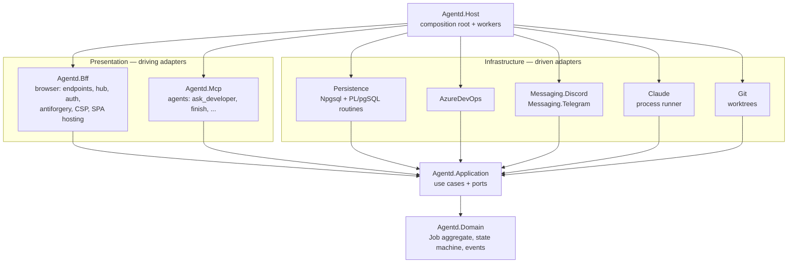

# agentd — Clean Architecture + BFF

This describes how the .NET 10 solution is structured. The **domain and use cases sit at the
center** and know nothing about Azure DevOps, Discord, Telegram, Claude, PostgreSQL or HTTP. The browser
talks only to a **Backend-for-Frontend (BFF)**, which owns the session, the cookies and the
UI-shaped API, so **no token ever reaches the browser**.

Related: [Architecture](README.md) · [Security](../security/README.md) · [UI](../ui/README.md)

---

## 1. Layers and the dependency rule



**Rule:** source code dependencies point **inward only**.

| Project | May reference | Must not reference |
|---|---|---|
| `Agentd.Domain` | nothing (BCL only) | everything else, Npgsql, ASP.NET Core |
| `Agentd.Application` | Domain, `Microsoft.Extensions.*.Abstractions` | Infrastructure, Presentation, Npgsql, Dapper, ASP.NET Core, Discord.Net, Telegram.Bot |
| `Agentd.Infrastructure.*` | Application, Domain, its external SDK | Presentation, other Infrastructure projects |
| `Agentd.Bff`, `Agentd.Mcp` | Application, Domain (read-only types) | Infrastructure |
| `Agentd.Host` | everything | — |

This is enforced two ways: project references, and **architecture tests** (§7).

---

## 2. Domain (`Agentd.Domain`)

Pure C# with no framework attributes. Mapping to and from database rows lives in the Persistence repositories ([data-access.md](data-access.md)).

- **Aggregate `Job`.** It owns the state machine from [Architecture §3.4](README.md#34-scheduler--supervisor-the-core).
  Transitions are methods, so an invalid transition cannot be expressed:

  ```csharp
  public sealed class Job : AggregateRoot<JobId>
  {
      public WorkItemId WorkItemId { get; }
      public JobState State { get; private set; }
      public ClaudeSessionId SessionId { get; }
      public BranchName Branch { get; }
      public int Attempt { get; private set; }

      public void Start(WorktreePath path, ChatThreadId thread) { Require(JobState.Preparing); ...; Raise(new JobStarted(Id)); }
      public void AskDeveloper(string question)                 { Require(JobState.Running); State = JobState.WaitingForHuman; Raise(new DeveloperQuestionAsked(Id, question)); }
      public void ResumeWith(DeveloperMessage reply)            { Require(JobState.WaitingForHuman, JobState.Running); ... }
      public void Finish(PullRequestDraft draft)                { Require(JobState.Running); State = JobState.Publishing; ... }
      public void Complete(PullRequestUrl url)                  { Require(JobState.Publishing); State = JobState.Done; ... }
      public void Fail(string reason) / Cancel(string by) / Retry()
  }
  ```

- **Value objects:** `WorkItemId`, `JobId`, `ClaudeSessionId`, `BranchName` (validated
  `ai/<id>-<slug>`), `WorktreePath`, `ChatThreadId`, `PullRequestUrl`, `Cost`, `TokenUsage`.
- **Domain events:** `JobQueued`, `JobStarted`, `DeveloperQuestionAsked`, `DeveloperReplied`,
  `JobFinished`, `PullRequestCreated`, `JobFailed`, `JobCancelled`. Persistence records them in the
  event log and publishes them after commit.
- **Domain services** (pure logic): `BranchNamer`, `RepositoryMatcher` (work item → repo rules).

---

## 3. Application (`Agentd.Application`)

Use cases plus the **ports** they need. There is **no mediator library**: handlers are plain
classes registered in DI, and endpoints and workers call them directly.

### 3.1 Use cases

| Kind | Use case | Called by |
|---|---|---|
| Command | `PollWorkItems` | Host worker (timer) |
| Command | `ClaimWorkItem` | `PollWorkItems`, BFF `POST /api/workitems/{id}/run`, chat `run` command |
| Command | `StartNextJob` | Host scheduler worker (when a slot is free) |
| Command | `RecordAgentOutput` | Claude runner (per stream-json line) |
| Command | `AskDeveloper` / `ReportProgress` / `FinishWork` | MCP tools |
| Command | `CompletePhase` / `ApproveGate` / `RejectGate` | MCP `complete_phase`; chat buttons, BFF |
| Command | `RecordLearning` / `RunRetrospective` / `DistillLearnings` | MCP, post-run, `LearningDistillationWorker` |
| Command | `InitKit` / `UpgradeKit` / `ValidateKit` / `LoadKitForJob` | CLI verbs, chat `init`, BFF Repositories page, job start |
| Command | `SyncPullRequests` / `StartPrReview` / `PostReview` / `StartPrFollowUp` / `ReplyToThreads` / `StartHotfix` / `StartBackport` | `PullRequestMonitorWorker`, BFF PR dashboard, chat ([pr-reviewer-and-monitor.md](pr-reviewer-and-monitor.md)) |
| Query | `GetLearnings` | MCP `get_learnings`, phase prompt builder, BFF |
| Command | `HandleInboundMessage` | every messaging provider's listener (dedupe → authorize → route → command or message) |
| Command | `SubmitDeveloperMessage` | `HandleInboundMessage`, BFF `POST /api/jobs/{id}/messages` |
| Command | `PublishPullRequest` | after `FinishWork` |
| Command | `CancelJob` / `RetryJob` | BFF, chat commands |
| Command | `RecoverJobsOnStartup` | Host startup |
| Query | `GetDashboard`, `GetJob`, `GetJobEvents`, `GetJobDiff`, `SearchHistory` | BFF |

```csharp
public interface ICommandHandler<in TCommand, TResult> { Task<Result<TResult>> Handle(TCommand command, CancellationToken ct); }
public interface IQueryHandler<in TQuery, TResult>     { Task<TResult> Handle(TQuery query, CancellationToken ct); }
```

- Handlers return `Result<T>` (success or a typed `Error`) for expected failures, such as
  `InvalidTransition`, `NotFound` or `AlreadyClaimed`. Exceptions are for bugs and infrastructure faults.
- Cross-cutting concerns (logging, tracing, transaction) are DI **decorators** around handlers,
  not framework pipelines.

### 3.2 Ports (interfaces implemented by Infrastructure)

| Port | Implemented in |
|---|---|
| `IJobRepository`, `IUnitOfWork` (an explicit `NpgsqlTransaction` scope; no ORM) | Persistence (PostgreSQL functions; [data-access.md](data-access.md)) |
| `IEventStore` (append, read after/before seq), `IEventPublisher` (live fan-out) | Persistence (+ `LISTEN/NOTIFY`) |
| `IWorkItemSource` (query, get, claim, comment) | AzureDevOps |
| `IPullRequestService` (push, create PR, list active PRs, threads, votes, policy/build status, merge status) | AzureDevOps + Git |
| `IReviewerCatalog` (predefined reviewers from `.agentd/reviewers/`) | Git (kit store) |
| `IMessagingProvider` (open conversation, send, edit, close, link, health) + `IMessagingProviderRegistry` | Messaging.Discord, Messaging.Telegram, … ([messaging-providers.md](messaging-providers.md)) |
| `IAgentRunner` (start/resume a session on a model profile, cancel) | Claude (`ClaudeCodeRunner`; profile → env) |
| `IModelRouter`, `IProfileHealth` (phase → ordered profiles; breaker, budget) | Host config + Persistence ([model-profiles.md](model-profiles.md)) |
| `IKitStore` (read the kit snapshot from the base branch; init and upgrade branches; 3-way merge) | Git + AzureDevOps ([ai-sdlc-kit.md](ai-sdlc-kit.md)) |
| `ILearningStore` (approved learnings, candidates, learnings PR) | Git + Persistence + AzureDevOps ([workflow-and-learning.md](workflow-and-learning.md)) |
| `IWorktreeManager` (create, remove, diff, prune) | Git |
| `IJobWorkflowEngine` (start, resume with a human response, cancel) | Orchestration: Microsoft Agent Framework workflows ([orchestration-maf.md](orchestration-maf.md)) |
| `IClock`, `IIdGenerator` | Host (defaults) |

The provider-agnostic `MessagingService` (routing, fan-out, chunking, mirroring, outbox) is an
Application service built on top of `IMessagingProvider`.

The Application layer also defines **read models** returned by queries, such as `JobSummary`,
`JobDetail`, `AgentEventDto` and `DashboardStats`. They are plain records that the BFF maps to its
own view models.

---

## 4. Infrastructure (`Agentd.Infrastructure.*`)

One project per external system, so that a dependency (e.g. Discord.Net) stays in one place:

| Project | Contents |
|---|---|
| `Infrastructure.Persistence` | `NpgsqlDataSource`, repositories calling PL/pgSQL routines (the schema itself is owned by the standalone `Agentd.Migrator`: FluentMigrator + raw SQL), event store (partitioned `events` table), outbox/`NOTIFY` publisher, `FOR UPDATE SKIP LOCKED` dequeue |
| `Infrastructure.AzureDevOps` | `AzureCliCredential` / PAT token providers, typed `HttpClient`s (WIQL, work items, comments, PRs), resilience |
| `Infrastructure.Messaging.Discord` | `DiscordMessagingProvider`, gateway listener, slash commands, Discord markdown renderer. Inbound events → `HandleInboundMessage`. |
| `Infrastructure.Messaging.Telegram` | `TelegramMessagingProvider`, long-polling (or webhook) listener, bot commands, inline keyboards, HTML renderer. Inbound updates → `HandleInboundMessage`. |
| `Infrastructure.Claude` | `ClaudeProcessRunner` (`ProcessStartInfo.ArgumentList`, secret-stripped env), stream-json parser → `RecordAgentOutput` |
| `Infrastructure.Git` | `git` CLI wrapper for worktrees, push, diff |
| `Infrastructure.Orchestration` | MAF workflow graph (versioned), executors, request ports, PostgreSQL checkpoint store, `IChatClientFactory`, MAF agents (retro, curator, bootstrap). The **only** project referencing `Microsoft.Agents.AI*`. |

Each project exposes a single `AddXxx(this IServiceCollection, IConfiguration)` extension, which the
Host calls.

---

## 5. Presentation

### 5.1 `Agentd.Bff`: Backend-for-Frontend (browser)

The Vue SPA talks **only** to the BFF, on the **same origin**. The BFF is the sole owner of browser
concerns:

| Responsibility | Details |
|---|---|
| **Session & auth** | SSO with Microsoft Entra ID / Google (OIDC code + PKCE) handled server-side ([authentication.md](../security/authentication.md)); the session is an HttpOnly cookie. **No access or refresh tokens in the browser.** Downstream credentials (ADO token/PAT, Discord bot token) never leave the server. |
| **Session endpoints** (`/bff/*`) | `GET /bff/login?provider=&returnUrl=` (challenge → Entra ID / Google), `GET /bff/providers`, `POST /bff/logout`, `GET /bff/user` (the current user, or 401), `GET /bff/antiforgery` (request token in the body) |
| **UI-shaped API** (`/api/*`) | one endpoint per screen need, returning **view models**, not domain or Application types: `GET /api/dashboard` (stats + active jobs in one call), `GET /api/jobs/{id}`, `GET /api/jobs/{id}/events`, `GET /api/jobs/{id}/diff`, `GET /api/history`, `POST /api/jobs/{id}/cancel`, … |
| **Real-time** | SignalR hub `/hubs/events` (read-only subscribe), fed by `IEventPublisher` |
| **Protection** | antiforgery filter on `/api` and `/bff` unsafe methods; CSP and security headers; Origin check on the hub ([Security](../security/README.md)) |
| **SPA hosting** | Razor shell (`SpaController`, `Views/Spa/Index.cshtml`). Production: assets from Vite's `.vite/manifest.json`. Development: Vite paths + HMR proxied to the dev server (`UseProxyToSpaDevelopmentServer`). See [Architecture §3.9](README.md#39-event-bus-and-web-ui-real-time-session-tracing). |
| **API contract** | the OpenAPI document is generated from BFF endpoints only; `web/` generates its TS types from it |

Endpoints stay thin: *bind → call the use case → map the `Result` to HTTP / view model*.

```csharp
public static class JobEndpoints
{
    public static RouteGroupBuilder MapJobEndpoints(this RouteGroupBuilder api)
    {
        api.MapGet("/dashboard", async (IQueryHandler<GetDashboard, DashboardReadModel> q, CancellationToken ct)
            => TypedResults.Ok(DashboardVm.From(await q.Handle(new(), ct))));

        api.MapPost("/jobs/{id:long}/cancel", async (long id, ClaimsPrincipal user,
                ICommandHandler<CancelJob, Unit> h, CancellationToken ct)
            => (await h.Handle(new CancelJob(new JobId(id), user.DisplayName()), ct)).ToHttpResult());
        return api;
    }
}
```

**Why a BFF here:** the browser gets exactly the data each screen needs in one round trip, all
credentials and third-party calls stay server-side, the cookie-plus-antiforgery model stays simple
(same origin, no CORS), and UI-driven API changes never leak into the Application layer.

**In-process today, splittable later.** The BFF runs in the same process as the daemon and calls
use cases directly. Because it depends only on Application interfaces, it can later move to its
own process (with the Application layer reached through PostgreSQL plus `LISTEN/NOTIFY`, or a small
internal API) without touching the Domain or Application code.

### 5.2 `Agentd.Mcp`: agent-facing adapter

MCP tools (`ask_developer`, `report_progress`, `finish`, `get_work_item`) map 1:1 to Application
commands. They use their own auth scheme (a per-job bearer token), and they share no cookies,
antiforgery setup or view models with the BFF.

---

## 6. Host (`Agentd.Host`): composition root

- `Program.cs` wires everything: `AddDomain()`, `AddApplication()`, `AddPersistence()`,
  `AddAzureDevOps()`, `AddMessagingDiscord()`, `AddMessagingTelegram()`, `AddClaude()`, `AddGit()`, `AddBff()`, `AddMcp()`.
- **Workers** (`BackgroundService`, driving adapters triggered by time):
  `WorkItemPollingWorker` → `PollWorkItems`, `SchedulerWorker` → `StartNextJob`,
  `MessagingDispatcherWorker` → delivers the outbox, `RetentionWorker` → drops old event partitions, and `StartupRecovery` → `RecoverJobsOnStartup`.
- Holds `wwwroot/` (the Vite build output), `appsettings*.json`, OpenTelemetry and health checks.
- Contains no business logic.

---

## 7. Tests

| Project | Scope |
|---|---|
| `Agentd.Domain.Tests` | the state machine, value object validation, domain events. Pure, fast. |
| `Agentd.Application.Tests` | handlers with in-memory fakes of the ports |
| `Agentd.Infrastructure.Tests` | Persistence against real PostgreSQL (Testcontainers); the stream-json parser against recorded fixtures; ADO clients against recorded HTTP |
| `Agentd.Bff.Tests` | `WebApplicationFactory`: auth, antiforgery (unsafe methods without the header → 400), CSP header present, view-model shape |
| `Agentd.ArchitectureTests` | enforces §1. For example: Domain has no reference outside the BCL; Application does not reference `Npgsql`, `Dapper`, `Microsoft.AspNetCore.*` `Discord` or `Telegram`; Bff/Mcp do not reference `Agentd.Infrastructure.*`; no `Infrastructure.Messaging.*` project references another. |

---

## 8. Where each component from the architecture lives

| Architecture component | Layer / project |
|---|---|
| Config | Host (`IOptions<T>` classes live in the project that consumes them) |
| Azure DevOps client | `Infrastructure.AzureDevOps` behind `IWorkItemSource` / `IPullRequestService` |
| Work Item Poller | Host worker → `PollWorkItems` use case |
| Scheduler / Supervisor | state machine in Domain `Job`; orchestration in Application handlers; timer in a Host worker |
| Worktree Manager | `Infrastructure.Git` behind `IWorktreeManager` |
| Agent Runner | `Infrastructure.Claude` behind `IAgentRunner` |
| agentd MCP server | `Agentd.Mcp` (Presentation) |
| Messaging (Discord, Telegram, …) | `IMessagingProvider` port + `MessagingService` / `HandleInboundMessage` in Application; one `Infrastructure.Messaging.*` project per platform |
| Event Bus | `IEventStore` / `IEventPublisher` ports → Persistence + in-process channels |
| Web Server / Web UI | `Agentd.Bff` + `web/` |
| PR Publisher | `PublishPullRequest` use case → `IPullRequestService` |
