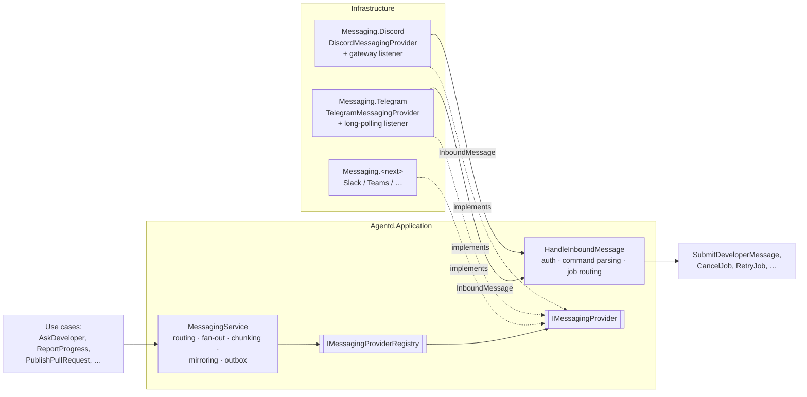

# agentd — Messaging Providers

The developer ↔ agent conversation goes through **messaging providers**, which are pluggable
adapters behind one Application port. **Discord** and **Telegram** are the first two. Adding
another (Slack, Microsoft Teams, …) means adding one Infrastructure project, with no change to the
Domain, Application or BFF.

Related: [Architecture](README.md) · [Clean Architecture + BFF](clean-architecture-bff.md) ·
[Discord reference](references/discord.md) · [Telegram reference](references/telegram.md)

---

## 1. Concepts

| Concept | Meaning | Discord | Telegram |
|---|---|---|---|
| **Provider** | one chat platform integration, identified by a key | `discord` | `telegram` |
| **Space** | where agentd posts, from config | guild + parent text channel | a supergroup with **Topics** enabled (forum) |
| **Conversation** | one per job per provider | thread | forum topic (`message_thread_id`) |
| **Message** | text + optional options (buttons) + attachments | message + components | message + inline keyboard |
| **Command** | a provider-neutral action: `status`, `cancel`, `retry`, `logs`, `list`, `run` | slash commands `/agentd …` | bot commands `/status`, `/cancel`, … |
| **Identity** | the platform user, mapped to an agentd user | user ID (snowflake) | numeric user ID |

A job can have **conversations on several providers at once**, for example a team channel on
Discord plus a personal Telegram topic. All of them show the same history (§5).

---

## 2. Architecture



- **Providers are thin.** They translate between the platform and the neutral model, and nothing
  more: no job logic, no authorization decisions, no command semantics.
- **Provider-agnostic logic lives in Application.** `MessagingService` (outbound) and
  `HandleInboundMessage` (inbound) are written once and shared by every provider.

---

## 3. The port (Application)

```csharp
public interface IMessagingProvider
{
    ProviderKey Key { get; }                                   // "discord", "telegram"
    MessagingCapabilities Capabilities { get; }

    Task<ConversationRef> OpenConversationAsync(ConversationSpec spec, CancellationToken ct);
    Task<MessageRef>      SendAsync(ConversationRef conversation, OutboundMessage message, CancellationToken ct);
    Task                  EditAsync(MessageRef message, OutboundMessage replacement, CancellationToken ct);   // no-op if !SupportsEditing
    Task                  CloseConversationAsync(ConversationRef conversation, string reason, CancellationToken ct);
    Uri?                  GetLink(ConversationRef conversation);
    Task<ProviderHealth>  CheckHealthAsync(CancellationToken ct);
}

public sealed record MessagingCapabilities(
    int MaxMessageLength,          // Discord 2000, Telegram 4096
    bool SupportsConversations,    // threads / topics; false → reply-chain fallback
    bool SupportsOptions,          // buttons for ask_developer(options)
    bool SupportsAttachments,
    bool SupportsEditing);         // edit a single "live progress" message instead of posting many

public interface IMessagingProviderRegistry
{
    IReadOnlyList<IMessagingProvider> Enabled { get; }
    IMessagingProvider Get(ProviderKey key);
}
```

**Neutral message model:**

```csharp
public sealed record OutboundMessage(
    MessageKind Kind,                         // Info, Progress, Question, Result, Error
    string Markdown,                          // CommonMark subset: paragraphs, **bold**, `code`, ```blocks```, links
    IReadOnlyList<MessageOption>? Options = null,       // ask_developer(options) → buttons
    IReadOnlyList<Attachment>? Attachments = null);      // logs, diffs

public sealed record InboundMessage(
    ProviderKey Provider,
    string ExternalMessageId,                 // for idempotency
    string ExternalConversationId,            // thread id / "chatId:topicId"
    string ExternalUserId,
    string UserDisplayName,
    string? Text,
    InboundCommand? Command,                  // already normalized: Name + Args
    string? SelectedOptionId,                 // a button press
    DateTimeOffset SentAt);
```

Each provider has an internal **renderer** that converts the neutral Markdown to its own format:
Discord markdown, or Telegram **HTML** `parse_mode`, whose escaping is simpler and safer than
MarkdownV2. It also turns `Options` into buttons, or into a numbered list when buttons are not
supported.

---

## 4. Outbound: `MessagingService`

1. **Resolve targets.** A job's conversations come from the `conversations` table. When a job
   starts, `MessagingService` opens one conversation per provider selected by the routing rules
   (§6).
2. **Render and chunk.** Messages are split to fit `MaxMessageLength`, never breaking a code block,
   and a `(1/3)` marker is added to each part. Long content (a diff or a log) becomes an
   attachment if the provider supports attachments, and a link to the Web UI otherwise.
3. **Progress coalescing.** For providers that support editing, `report_progress` **edits** one
   pinned "status" message instead of posting a new one each time. Otherwise updates are batched,
   with at most one post per 10 seconds per conversation.
4. **Outbox.** Outbound messages are written to `outbound_messages` **in the same transaction** as
   the state change that caused them. A `MessagingDispatcherWorker` delivers them with per-provider
   rate limits and exponential backoff.
   - A provider outage **never fails a job**. Messages wait in the outbox, and `/healthz` reports
     the provider as degraded.

---

## 5. Inbound: `HandleInboundMessage`

```
provider listener → InboundMessage → HandleInboundMessage
   1. dedupe on (provider, external_message_id)
   2. authorize: map (provider, external_user_id) → agentd user; unknown → ignore (+ log)
   3. route: (provider, external_conversation_id) → job   | parent space → global commands (list, run)
   4. command?  → CancelJob / RetryJob / GetJob(status) / SendLogs …
      option?   → SubmitDeveloperMessage(text = option label, optionId)
      text      → SubmitDeveloperMessage(text)
   5. mirror: post "↩ tngo (Telegram): No, remove it" to the job's *other* conversations
```

- **The first answer wins.** When a job is `WaitingForHuman`, the first accepted message resumes the
  Claude session. Messages that arrive afterwards, from any provider or the Web UI, are queued as
  the next turn.
- **Mirroring:**
  - every conversation of a job, plus the Web UI, shows the full exchange;
  - messages sent from the Web UI are mirrored to all of the job's conversations;
  - the mirrored copies are marked, so they are never treated as new input.
- **Event log:** `message.inbound` and `message.outbound` events carry a `provider` field, so the
  Web UI can label each message's origin.

---

## 6. Configuration

Chat identities are part of the shared **user directory** (top-level `Users`, with
`Identities.Discord` / `Identities.Telegram`), which also backs web SSO and roles
([authentication.md §4](../security/authentication.md#4-users-identities-and-roles)). Chat actions
follow the same roles. For example, only an `Operator` can reply to an agent or `cancel` a job.

```jsonc
"Messaging": {
  "DefaultProviders": ["discord"],            // conversations opened for every job
  "Providers": {
    "Discord": {
      "Enabled": true,
      "GuildId": "123...",
      "ChannelId": "456..."                   // parent channel; one thread per job
      // token: Agentd__Messaging__Providers__Discord__BotToken
    },
    "Telegram": {
      "Enabled": true,
      "ChatId": "-1001234567890",             // supergroup with Topics enabled
      "Mode": "LongPolling"                   // LongPolling | Webhook
      // token: Agentd__Messaging__Providers__Telegram__BotToken
    }
  }
},
```

A per-repo override lives in the repo's kit, `.agentd/kit.json`: `"messaging": { "providers":
["discord", "telegram"] }`. It is limited to the providers the operator has enabled.

A work item can also pick providers with a `chat:telegram` tag, which overrides the repo and default
settings.

---

## 7. Persistence (Domain + Persistence)

| Table | Columns | Purpose |
|---|---|---|
| `conversations` | `job_id`, `provider`, `external_conversation_id`, `external_space_id`, `link`, `opened_at`, `closed_at` | unique `(provider, external_conversation_id)`; replaces `discord_thread_id` on `jobs` |
| `outbound_messages` | `id`, `job_id`, `provider`, `conversation_id`, `payload jsonb`, `status`, `attempts`, `next_attempt_at`, `external_message_id` | outbox |
| `inbound_messages` | `provider`, `external_message_id`, `job_id`, `received_at` | idempotency; unique `(provider, external_message_id)` |

---

## 8. Provider implementations

| Aspect | Discord (`Infrastructure.Messaging.Discord`) | Telegram (`Infrastructure.Messaging.Telegram`) |
|---|---|---|
| Library | Discord.Net | Telegram.Bot |
| Receiving | gateway WebSocket (`DiscordSocketClient`) | **long polling** `getUpdates` by default, because the daemon runs on localhost with no public URL. A webhook with `secret_token` is optional. |
| Open conversation | starter message + thread | `createForumTopic` → `message_thread_id` |
| Send | message in the thread | `sendMessage(chat_id, message_thread_id, parse_mode=HTML)` |
| Options | message components (buttons) → `InteractionCreated` | inline keyboard → `callback_query` (+ `answerCallbackQuery`) |
| Commands | slash commands `/agentd status …` | `setMyCommands` (group scope): `/status`, `/cancel`, `/retry`, `/logs`, `/list`, `/run <id>` |
| Edit progress | ✅ | ✅ `editMessageText` |
| Attachments | ✅ | ✅ `sendDocument` |
| Close | archive thread | `closeForumTopic` |
| Link | `https://discord.com/channels/{guild}/{thread}` | `https://t.me/c/{chat}/{topic}` (private supergroups) |
| Required bot setup | Message Content intent | bot is an **admin** with *Manage Topics*; privacy mode off, or admin rights, so it sees plain replies |
| Fallback | — | if Topics are disabled: **reply-chain mode**, with one root message per job; replies to it route to the job |

---

## 9. Adding a provider

1. Create `Agentd.Infrastructure.Messaging.<Name>` that references Application only.
2. Implement `IMessagingProvider`, plus a renderer (neutral Markdown → the platform's format).
3. Add a hosted listener that normalizes platform updates into `InboundMessage` and calls
   `HandleInboundMessage`.
4. Add an `AddMessaging<Name>(IServiceCollection, IConfiguration)` extension, a config section
   under `Messaging:Providers:<Name>`, and a secret named `Agentd__Messaging__Providers__<Name>__BotToken`.
5. Make the shared **contract test suite** (`MessagingProviderContractTests<TProvider>`) pass. It
   covers chunking limits, the rendering and escaping of untrusted text, idempotent inbound handling,
   option round-trips and the health check.
6. Add `references/<name>.md`.

---

## 10. Security

- **Only mapped users can steer agents.** Unmapped senders are ignored on every provider, and the
  mapping is per provider (a Discord ID never authorizes a Telegram user).
- **Every inbound text is untrusted prompt input**, with the same mitigations as in
  [Architecture §5](README.md#5-security-considerations).
- **Renderers escape all agent- and user-supplied text.** Telegram HTML entities and Discord
  mentions are neutralized, so an agent cannot ping `@everyone` or inject markup.
- **Bot tokens** come from env or a secret store only, and are stripped from Claude process
  environments.
- **Telegram webhooks** (if used) must verify the `X-Telegram-Bot-Api-Secret-Token` header, and are
  exposed only through the tunnel or reverse proxy.
