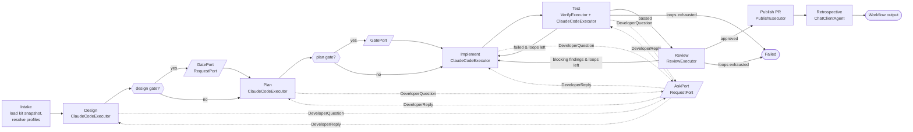

# agentd — Orchestration with Microsoft Agent Framework

agentd uses **Microsoft Agent Framework (MAF)** as the **orchestration layer**:

- **Workflows** drive the Design → Plan → Implement → Test → Review pipeline, with its loops,
  human gates, `ask_developer` waits and checkpoints.
- **MAF agents** run the **non-coding LLM steps**: retrospective, learnings curator and kit bootstrap.

The **coding work itself stays in the Claude Code CLI** (`ClaudeCodeRunner`), wrapped as a
workflow executor. MAF's Harness Agent is an optional, benchmark-gated second runner.

Related: [Workflow & Learning](workflow-and-learning.md) · [Model Profiles](model-profiles.md) ·
[Clean Architecture + BFF](clean-architecture-bff.md) · [ai-sdlc kit](ai-sdlc-kit.md)

---

## 1. Decision summary

| Concern | Choice | Why |
|---|---|---|
| Phase pipeline, loops, gates, waits | **MAF Workflows** (`Microsoft.Agents.AI.Workflows`, GA in 1.0) | typed executors and edges replace hand-written orchestration code; request/response for human-in-the-loop; checkpoint and resume for waits that last days; OpenTelemetry built in |
| Coding phases (Design, Plan, Implement, Test fixes) | **Claude Code CLI** via `ClaudeCodeRunner`, as a custom executor | Claude Code's coding harness (edit tools, permissions, sessions, `CLAUDE.md`, compaction) is the most mature option. MAF's `ClaudeAgent` wrapper is **Python-only and preview**; in .NET, MAF only has the raw Anthropic *model* connector. |
| Non-coding steps (Retrospective, Distill, Kit bootstrap; optionally Review) | **MAF `ChatClientAgent`** over `IChatClient`, with structured output | runs on any provider through first-party connectors (Anthropic, OpenAI-compatible, **Gemini**, Bedrock, Ollama) without a gateway |
| Alternative runner for non-Claude profiles | **MAF Harness Agent** (`Microsoft.Agents.AI.Harness`) behind `IAgentRunner`, **experimental** | adopted per profile only if it matches Claude Code on the benchmark set (§6) |
| Not used | AG-UI, DevUI in production, A2A, Durable Functions hosting (preview), Foundry hosting | the BFF + SignalR and our own hosting already cover these; DevUI is fine for local debugging |

---

## 2. The job workflow graph



| Executor (stable ID) | Kind | Does |
|---|---|---|
| `intake` | custom | `LoadKitForJob`, resolves the phase → profile chain (`IModelRouter`), and applies phase skipping from kit tags |
| `design`, `plan`, `implement` | `ClaudeCodeExecutor` | builds the phase prompt (kit + learnings + artifacts), runs or resumes `claude` on the phase's profile, and waits for `complete_phase` or a `DeveloperQuestion` |
| `test` | `VerifyExecutor` | runs the kit's `verify` commands. On failure it emits `TestFailed` (edge back to `implement`, with the report as input), and on success `TestPassed`. |
| `review` | `ReviewExecutor` | a fresh read-only reviewer session, run on Claude Code or a `ChatClientAgent` depending on the profile. Emits `ReviewApproved` or `ReviewFindings`. |
| `publish` | custom | the `PublishPullRequest` use case |
| `retro` | `ChatClientAgent` (`Id = "retro-agent"`) | structured retrospective → `RecordLearning` candidates |
| `gate-port` | `RequestPort<GateRequest, GateDecision>` | human approval of design or plan (chat buttons or the Web UI) |
| `ask-port` | `RequestPort<DeveloperQuestion, DeveloperReply>` | `ask_developer` from any coding phase |

Loop limits come from the kit (`maxFixLoops`, `maxReviewLoops`) and are enforced in the executors'
checkpointed state. When a limit is exhausted, the executor routes to `Failed` rather than looping again.

### Sketch (.NET)

```csharp
// Sketch — verify signatures against the MAF version pinned in Directory.Packages.props.
var askPort  = RequestPort.Create<DeveloperQuestion, DeveloperReply>("ask-port");
var gatePort = RequestPort.Create<GateRequest, GateDecision>("gate-port");

var workflow = new WorkflowBuilder(intake)
    .AddEdge(intake, design)
    .AddEdge(design, gatePort /* when kit.gates.design */).AddEdge(gatePort, plan)
    .AddEdge(plan, implement)                      // plan gate wired the same way
    .AddEdge(implement, test)
    .AddEdge(test, implement /* on TestFailed */)
    .AddEdge(test, review    /* on TestPassed */)
    .AddEdge(review, implement /* on ReviewFindings */)
    .AddEdge(review, publish   /* on ReviewApproved */)
    .AddEdge(publish, retro)
    .AddEdge(design, askPort).AddEdge(askPort, design)          // same for plan/implement/test
    .WithOutputFrom(retro)
    .Build();
```

```csharp
internal sealed partial class ClaudeCodeExecutor(PhaseKind phase, IAgentRunner runner, IPhasePromptBuilder prompts)
    : Executor($"{phase}".ToLowerInvariant())                     // stable executor ID = phase name
{
    private PhaseSessionState _state = new();                     // profile, session id, loop count

    [MessageHandler]
    private async ValueTask HandleAsync(PhaseInput input, IWorkflowContext ctx)
    {
        var outcome = await runner.RunPhaseAsync(prompts.Build(phase, input, _state), _state, ctx.CancellationToken);
        await (outcome switch
        {
            PhaseOutcome.Completed c     => ctx.SendMessageAsync(c.Artifact),          // → next edge
            PhaseOutcome.NeedsHuman q    => ctx.SendMessageAsync(q.Question),          // → ask-port
            PhaseOutcome.Failed f        => ctx.YieldOutputAsync(JobResult.Failed(f.Reason)),
        });
    }

    [MessageHandler]
    private ValueTask HandleReplyAsync(DeveloperReply reply, IWorkflowContext ctx)
        => HandleAsync(PhaseInput.Resume(reply), ctx);             // resume the same claude session

    protected override ValueTask OnCheckpointingAsync(IWorkflowContext ctx, CancellationToken ct = default)
        => ctx.QueueStateUpdateAsync("state", _state);
    protected override async ValueTask OnCheckpointRestoredAsync(IWorkflowContext ctx, CancellationToken ct = default)
        => _state = await ctx.ReadStateAsync<PhaseSessionState>("state");
}
```

---

## 3. Long waits: checkpoint, release, resume

agentd must not keep anything in memory while a human takes hours or days to answer.

1. A coding executor's `claude` process calls the MCP tool `ask_developer`. The tool answers "end
   your turn", and **the process exits** (same as before).
2. The executor sends a `DeveloperQuestion` to `ask-port`. The workflow emits a `RequestInfoEvent`,
   and at the end of that superstep MAF writes a **checkpoint**. The checkpoint includes pending
   requests and executor state (profile, session ID, loop count).
3. `JobWorkflowHost` handles the `RequestInfoEvent`:
   - it calls `AskDeveloper`, which posts the question to chat and sets the job to `WaitingForHuman`;
   - it stores the checkpoint;
   - it **disposes the run**. Nothing stays in memory.
4. When a reply arrives through `HandleInboundMessage` → `SubmitDeveloperMessage`, the host:
   - **rehydrates** the workflow with `InProcessExecution.ResumeStreamingAsync(workflow, checkpoint, checkpointManager)`;
   - receives the **re-emitted** `RequestInfoEvent`;
   - answers it with `SendResponseAsync(request.CreateResponse(reply))`.

   MAF routes the reply to the executor that asked, which resumes the same Claude session.

Gates (`gate-port`) work the same way. **Daemon restart recovery** is simply "resume every non-final
job from its latest checkpoint".

### Checkpoint storage

- The checkpoint store is **custom and backed by PostgreSQL**, plugged into MAF's `CheckpointManager`.
  The table is `workflow_checkpoints`: `job_id`, `checkpoint_id`, `superstep`, `workflow_version`,
  `payload jsonb`, `created_at`. `jobs.current_checkpoint_id` points to the latest.
- Checkpoints are a **trust boundary**. The table is only writable by the daemon's DB role, and
  checkpoints are never imported from outside.
- Retention: keep the latest *N* checkpoints per job, plus the final one. Delete them with the job's
  events once retention expires.

### Topology versioning

Resuming requires **the same topology and executor IDs**. Therefore:

- executor IDs are fixed phase names, and every `ChatClientAgent` has a fixed `ChatClientAgentOptions.Id`
  (and `Name`), e.g. `retro-agent` and `curator-agent`;
- each job records `workflow_version`. The host keeps builders for **every version with in-flight
  jobs**, so a graph change only applies to new jobs;
- if an old version must be retired, its in-flight jobs restart their current phase on the new
  version, seeded with the artifacts already produced (the same handoff used for profile switches).

---

## 4. Source of truth: Domain vs MAF

| State | Owner |
|---|---|
| Business state: `Job.State`, `Job.Phase`, gates, artifacts, PR, cost | **Domain `Job` aggregate** (PostgreSQL), changed only through use cases |
| Execution position: which executor runs next, pending requests, executor-local state | **MAF checkpoint** |

- Executors never change the database directly. They call Application use cases (`CompletePhase`,
  `AskDeveloper`, `PublishPullRequest`, `RecordLearning`), which enforce the Domain rules.
- MAF workflow events are mapped onto our Event Bus: executor invoked/completed →
  `phase.started` / `phase.completed`, and `RequestInfoEvent` → `job.waiting`. The Web UI keeps
  working unchanged.
- **If the two disagree** (e.g. a crash between a use case commit and a checkpoint), the Domain wins.
  On resume, `intake` and each executor check the `Job` state and skip work that is already
  recorded as done, which makes executors idempotent.

---

## 5. Non-coding agents on MAF

| Agent (stable ID) | Input → structured output | Default profile |
|---|---|---|
| `retro-agent` | run signals + artifacts → `LearningCandidate[]` | same as Implement |
| `curator-agent` | `learnings.md` + candidates → `LearningsEdit[]` | cheap (e.g. GLM) |
| `bootstrap-agent` | repo tree + detected files → `KitPrefill` (context, verify, checklist) | cheap |
| `review-agent` (optional) | diff + design/plan + checklist + learnings → `ReviewReport` | a different family from Implement |

- **`IChatClient` per profile** comes from `IChatClientFactory` in `Infrastructure.Orchestration`,
  following [model-profiles.md](model-profiles.md):

  | Profile | Chat client |
  |---|---|
  | `AnthropicApi` | Anthropic connector |
  | `AnthropicCompatible` (DeepSeek, GLM) | Anthropic connector with a base URL, or their OpenAI-compatible APIs through the OpenAI connector |
  | `Gemini` | MAF's **Gemini connector**, natively, with no gateway |
- MAF middleware adds **cost accounting**, **secret redaction**, and **OpenTelemetry** spans tagged
  with `job.id`, `phase` and `profile`.
- These agents get **no file-writing or shell tools**. The reviewer, if run on MAF, gets read-only
  function tools (`read_file`, `grep`, `git_diff`) scoped to the worktree.

---

## 6. Optional runner: MAF Harness Agent (experimental)

`HarnessAgentRunner : IAgentRunner` builds a `HarnessAgent` from the profile's `IChatClient`:

- **File access** is a `FileAccessStore` rooted at the job worktree, with `paths.protected` and
  `.agentd/**` denied.
- **Shell tools** are limited to the kit's `verify` commands and `git`, **tool approval** is mapped
  to our permission policy, and **compaction** is sized to the profile's context window.
- It is enabled per profile with `"Runner": "MafHarness"`. The default is `"ClaudeCode"`.

**Adoption gate:** run both runners on a fixed benchmark set of past work items for each repo, and
compare pass rate (Review approved + human PR accepted), fix loops, turns and cost. Switch a
profile's default runner only if the Harness Agent is at least on par. This is also the path for
coding on Gemini without a gateway.

---

## 7. Where it lives in the solution

| Concern | Project |
|---|---|
| `IJobWorkflowEngine` port (`StartAsync(job)`, `ResumeAsync(jobId, response)`, `CancelAsync(jobId)`) | `Agentd.Application` (framework-free) |
| Workflow graph builders (versioned), executors, request ports, `JobWorkflowHost`, PostgreSQL checkpoint store, `IChatClientFactory`, MAF agents, middleware | **`Agentd.Infrastructure.Orchestration`** (the only project referencing `Microsoft.Agents.AI.*`) |
| `ClaudeCodeRunner` (used by `ClaudeCodeExecutor`) | `Agentd.Infrastructure.Claude` (unchanged) |
| `HarnessAgentRunner` (experimental) | `Agentd.Infrastructure.Orchestration` |
| Hosting `JobWorkflowHost` + startup recovery | `Agentd.Host` |

The architecture tests also enforce that **only** `Infrastructure.Orchestration` references
`Microsoft.Agents.AI*`, and that Domain and Application never do.

**Packages:**

- GA: `Microsoft.Agents.AI`, `Microsoft.Agents.AI.Workflows`, plus the model connectors in use.
- Preview or optional: `Microsoft.Agents.AI.Harness`.
- All versions are pinned in `Directory.Packages.props`. Preview packages are only referenced from
  code paths behind a feature flag.

---

## 8. Risks

| Risk | Mitigation |
|---|---|
| API churn in MAF (especially preview parts) | pinned versions; MAF isolated in one adapter behind `IJobWorkflowEngine`; preview features behind flags |
| Checkpoint incompatibility after graph changes | versioned builders, stable IDs, restart-phase fallback (§3) |
| Two sources of state drifting apart | the Domain is authoritative; executors are idempotent (§4) |
| Harness Agent quality below Claude Code | benchmark-gated, per-profile opt-in (§6) |

---

## References

- [MAF overview](https://learn.microsoft.com/en-us/agent-framework/overview/agent-framework-overview)
- [Workflows: concepts](https://learn.microsoft.com/en-us/agent-framework/concepts/workflows/) · [executors](https://learn.microsoft.com/en-us/agent-framework/concepts/workflows/executors) · [human-in-the-loop](https://learn.microsoft.com/en-us/agent-framework/workflows/human-in-the-loop) · [checkpoints](https://learn.microsoft.com/en-us/agent-framework/workflows/checkpoints)
- [Agent Harness](https://learn.microsoft.com/en-us/agent-framework/concepts/harness)
- [MAF 1.0 release notes](https://devblogs.microsoft.com/agent-framework/microsoft-agent-framework-version-1-0/)
- [Anthropic model provider](https://learn.microsoft.com/en-us/agent-framework/integrations/by-component/model-providers/anthropic) · [Claude Agent SDK agent (Python)](https://learn.microsoft.com/en-us/agent-framework/integrations/by-component/agent-services/anthropic-claude)
