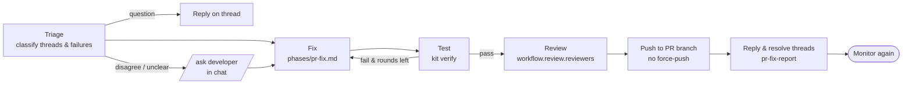
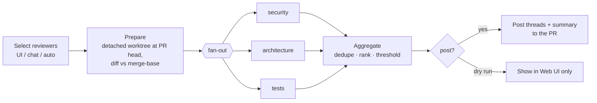

# agentd — PR Reviewer, PR Monitor & Hotfixes

agentd's job doesn't end when a PR opens. Three capabilities cover the rest of the PR lifecycle:

- **PR Reviewer** runs the repo's **predefined reviewers** (security, architecture, tests, …, defined
  in the ai-sdlc kit) against any open PR, and posts findings as PR comment threads.
- **PR Monitor** watches open PRs for review comments, failing builds, merge conflicts and a moved
  target branch. It **keeps fixing** them by pushing follow-up commits to the PR branch and replying
  on the threads.
- **Hotfix** is an expedited flow that branches from a release branch, fixes, opens a PR, and
  backports to `main`.

All three are driven from the **PR dashboard** in the Web UI and from chat. All their configuration
lives in the repo's **ai-sdlc kit** (`.agentd/`).

Related: [ai-sdlc kit](ai-sdlc-kit.md) · [Workflow & Learning](workflow-and-learning.md) ·
[Orchestration (MAF)](orchestration-maf.md) · [UI](../ui/README.md) · [Azure DevOps reference](references/azure-devops.md)

---

## 1. Kit structure (additions to `.agentd/`)

```
.agentd/
├── kit.json                  # + "pr" and "hotfix" sections (§5)
├── reviewers/                # NEW: one file per predefined reviewer
│   ├── README.md             #   how to add or tune a reviewer
│   ├── general.md            #   default reviewer (replaces checklists/review.md)
│   ├── security.md
│   ├── architecture.md
│   ├── tests.md
│   └── performance.md
├── phases/
│   ├── design.md … review.md
│   ├── pr-fix.md             # NEW: address review threads, CI failures, conflicts
│   └── hotfix.md             # NEW: expedited fix on a release branch
└── templates/
    ├── design.md … review.md
    ├── pr-review-summary.md  # NEW: summary comment posted on the PR
    ├── pr-fix-report.md      # NEW: what each fix round changed, and the thread replies
    └── hotfix.md             # NEW: hotfix PR description (impact, root cause, rollback, backport)
```

`kit init` creates these with defaults, and `kit upgrade` migrates `checklists/review.md` into
`reviewers/general.md` ([ai-sdlc-kit.md §2.3](ai-sdlc-kit.md#23-upgrade)). As with every kit file,
the team owns and edits them.

### Reviewer definition (`.agentd/reviewers/security.md`)

```markdown
---
name: security
title: Security reviewer
description: AuthN/AuthZ, input validation, secrets, injection, CSP/cookie rules.
appliesTo: ["src/**", "src/Agentd.Web/ClientApps/dashboard/**"]          # a reviewer is skipped when no changed file matches
autoOn: ["src/Agentd.Bff/**", "**/Auth*/**"]  # auto-run when these paths change (§3.3)
severityThreshold: medium                     # only post findings at this level or higher
maxFindings: 15
model: ["claude-api", "glm-flash"]            # preference; capped by the operator's AllowedProfiles
tools: read-only                              # always read-only; stated for clarity
---

## Focus
- Every state-changing endpoint is under `/api` or `/bff` and carries the antiforgery filter.
- No `v-html`, `innerHTML`, inline scripts or styles (see docs/security/README.md §3).
- ...

## Ignore
- Generated files under `src/Agentd.Web/ClientApps/shared/api/schema.d.ts`.

## Output
Use the finding format in the core rules. Cite file and line. Suggest a concrete fix.
```

**The workflow's Review phase uses the same reviewers.** `kit.json` → `workflow.review.reviewers`
(default `["general"]`) selects which reviewers run on the job's own branch before the PR is opened.
That means one set of reviewer definitions for both agent PRs and human PRs.

---

## 2. PR Monitor

### 2.0 First version (decided 2026-10-10)

Built before the MAF workflows (Phase 4), on what agentd already has: the review loop for its own PRs, and review
sessions' Fix it (a checkout of the PR head, an edit-only agent, a commit as agentd, a push that's never forced).
The rest of §2 is the longer-term design.

**Which PRs.** agentd's own PRs, plus PRs someone **watches**:
- `!watch !3944 [--repo r]` in chat, or **Watch** on a PR's review page. Watching opens a 👀 thread for the PR, where
  reports and approvals happen; `!unwatch !3944` (or `unwatch` in that thread) stops it.
- A PR that's completed or abandoned stops being watched.

**Signals and what they start.**

| Signal | On a watched PR | On agentd's own PR |
|---|---|---|
| A PR build (build validation) **failed** | a fix round with the failed steps' errors and log end | a fix round in the job's session (its review loop) |
| **Merge conflicts** with the target | a fix round: merge the target into the source, resolve, never rebase | the same, in the job's session |
| A **new active comment** from someone agentd knows (someone who connected their Azure DevOps in agentd: the comment author's sign-in name matches) | a fix round with the comment (no mention needed) | today's review loop |
| **Completed / abandoned** | stop watching | today's handling |

Rounds are **debounced** (5 minutes without new signals, so one review pass is one round), at most **5 fix rounds per
watched PR** (then it asks in the 👀 thread), and never two at once for the same PR. agentd ignores its own comments.

**Ask first.** On a watched PR a round **prepares** the fix and asks before anything is pushed:
1. A checkout of the PR head (for conflicts, `git merge origin/<target>` first); the fixer (the review sessions'
   `ReviewFix` turn: edits only, no commit or push tools) fixes the build errors, conflicts or comments; agentd commits.
2. In the 👀 thread: what failed, what changed (files, `+/-`, the fixer's summary) and **1** push · **2** discard.
3. **Push**: `HEAD:refs/heads/<branch>`, never forced (a branch that moved on refuses it: the round is dropped and
   the next signal starts a new one). Addressed comment threads get "Fixed in `abc1234`" and status fixed; a short note
   goes on the PR naming who approved it in chat (with agentd's identity: a chat user isn't tied to an Azure DevOps
   sign-in yet). **Discard** drops the checkout. A prepared round nobody answers expires after 24 hours; a PR that's
   completed, or `unwatch`, discards it too.

agentd's own PRs keep their job's flow: their fix rounds push as today. The review loop (`ReviewPullRequests`, every
`Jobs:ReviewPollInterval`) reads the same signals: the latest run on `refs/pull/<id>/merge` failing (its failed steps'
errors and log end become the round's feedback) and `mergeStatus` `conflicts` (the feedback tells the agent to
`git merge origin/<target>`, resolve, test and commit; never rebase, since agentd pushes without force). Comments, the
build and conflicts found in one pass make one round. The job's `review_state` remembers the handled run
(`lastBuildId`) and the conflicted head (`conflictCommit`), so each starts one round; still conflicting after the push
(a new head) is a new round. Past `Jobs:MaxFixRounds` it asks once to take over.

**How it's built.** `PrMonitor` runs in the review monitor's pass (every `Jobs:ReviewPollInterval`, 2 minutes): the
PR (status, `mergeStatus`), its comments (with the author's `uniqueName`), and its latest PR build (the runs on
`refs/pull/<id>/merge`). The first signal posts "🔔 … I'll prepare a fix after 5 quiet minutes" in the 👀 thread;
after 5 minutes without new signals it hands a `PrFixRequest` (the failed run's errors and log end, conflicts, the
comments) to `IPrFixRounds`, counting the round first. What was handled is remembered (`seen_comments`,
`last_build_id`), so nothing starts two rounds.

`PrFixRounds` prepares in the background (one round at a time across PRs: each runs an agent), so the monitor's pass,
which also runs the job review rounds, never waits for it; the monitor leaves a watch alone while its round prepares
(`IsBusy`) or waits (`pending`). The checkout is `worktrees/<repo>/pr-fix-<watch id>`; for conflicts
`git merge --no-ff --no-commit origin/<target>` lists the conflicted files, and the round gives up if any still holds
`<<<<<<<` after the fixer. The fixer runs as the `fix` step's model when that's a Claude one, otherwise Claude's
default. The prepared fix (`pending`: checkout, commit, summary, the comment threads, expiry) is stored on the watch.
Answers in the 👀 thread (**1** / push / yes, **2** / discard / no, from anyone allowed in chat) are serialized per PR
and act on the latest state, so parallel answers push once. Whatever the outcome, the pending fix is cleared and its
checkout removed.

### 2.1 What it watches

`PullRequestMonitorWorker` polls every registered repo (default every 60 s, with per-repo ETags or
cursors). Polling is used because the daemon runs on localhost. ADO service hooks to a tunneled
webhook are an optional upgrade.

| Signal | ADO source | Default reaction |
|---|---|---|
| New or updated **active comment thread** from an authorized reviewer | PR threads API | `PrFollowUp` job → fix, or reply |
| **Reviewer vote** "waiting for author" / "rejected" | PR reviewers | include that reviewer's threads in the next fix round |
| **Build validation failed** | policy evaluations + build timeline and logs | `PrFollowUp` job with the extracted errors |
| **Merge conflicts** | `mergeStatus = conflicts` | `PrFollowUp` job: merge target into source, resolve, test |
| **Target branch moved** (source is behind) | commits diff | optional auto-merge of the target (off by default) |
| **New push by a human** | iterations | cancel any running fix round for that PR, and re-run auto reviewers (§3.3) |
| **PR completed or abandoned** | status | stop monitoring; run the learning follow-up retrospective |

Which PRs are monitored is set by `kit.json` `pr.monitor.scope`:

- `agentd` (default): PRs created by agentd.
- `opted-in`: agentd PRs plus any PR where an Operator turned monitoring on (dashboard or `/monitor <pr>`).
- `all`: every active PR in the repo. Auto-*fix* still requires an explicit trigger on PRs that
  agentd didn't create (§2.4).

### 2.2 The fix round (`PrFollowUp` job)

This is a MAF workflow, like the main job workflow, with checkpoints and the same messaging and Web
UI tracing:



1. **Triage** (a MAF agent with structured output) sorts each new thread or failure into one of:
   `actionable` (needs code), `question` (reply only), `disagree/unclear` (escalate to the
   developer in chat), `out-of-scope` (reply + suggest a follow-up work item), or `stale`
   (already addressed).
2. **Fix** runs on the PR's source branch, in a worktree of that branch. If the PR came from
   agentd, it **resumes the original job's session** (or starts a new one with the artifact
   handoff, if the profile changed).
3. **Test → Review → Push:**
   - pushes are **normal commits only, never force-pushes**;
   - conflicts are resolved by **merging the target branch into the source**, never by rebasing;
   - each round is one commit or more, with a message like `fix(pr#123): address review — …`.
4. **Reply and resolve:**
   - each addressed thread gets a reply ("Fixed in `abc123`: …") and its status is set to `fixed`;
   - question threads get an answer and stay `active`, so the human resolves them;
   - the round summary (`templates/pr-fix-report.md`) is posted as a PR comment and to chat.
5. **Limits:**
   - `pr.monitor.maxFixRounds` (default 5) per PR. When it is reached, agentd stops and asks in chat.
   - Rounds are **debounced**, waiting for 5 minutes of reviewer quiet, so one review pass produces
     one fix round, not one per comment.

### 2.3 Hot fixes to an open PR

An Operator can force an immediate round from the dashboard (**Fix now**, with an optional
free-text instruction) or from chat (`/fix <pr> <instruction>`). This skips triage debouncing and
uses the same pipeline, which is useful for "the CI is red, push a fix now".

### 2.4 Who can trigger code changes

PR comments are **untrusted prompt input**, so the rules are:

- Only threads authored by **authorized reviewers** trigger fixes. That means users in the agentd
  user directory with an `AzureDevOps` identity (`Users[].Identities.AzureDevOps`), or members of
  the repo's configured ADO groups (`pr.monitor.trustedGroups`).
- On PRs agentd **did not create**, fixes need an **explicit trigger**: a dashboard/chat action by
  an Operator, or a thread comment containing the configured mention (`@agentd fix`) from an
  authorized reviewer.
- PRs **from forks or external contributors are never auto-fixed or auto-reviewed.**
- agentd ignores its own comments, recognized by its ADO identity plus a hidden marker in the comment.

---

## 3. PR Reviewer

### 3.1 Review run



- **Prepare:** `git worktree add --detach <headSha>` (read-only use), plus the diff against the
  merge base with the target. A reviewer whose `appliesTo` matches no changed file is skipped.
- **Fan-out:** every selected reviewer runs **in parallel** as its own read-only session (MAF
  concurrent fan-out/fan-in; [orchestration-maf.md](orchestration-maf.md)), on its preferred
  profile. Each gets:
  - its reviewer file;
  - the diff and changed files;
  - `.agentd/context.md`;
  - the path-matched learnings;
  - the PR title, description and linked work items.
- **Aggregate:** findings are
  - normalized to `{ reviewer, severity, file, line, title, body, suggestion, fingerprint }`;
  - **de-duplicated across reviewers and across previous runs** (by fingerprint: file + normalized
    title + nearby code hash);
  - ranked and cut by `severityThreshold` and `maxFindings`.
- **Post** (unless dry run):
  - one **PR thread per finding**, anchored to file and line, with the reviewer name as a prefix
    (e.g. `[security] …`);
  - one **summary comment** (`templates/pr-review-summary.md`) with counts per reviewer and severity;
  - on a re-review, agentd **resolves its own earlier threads** that no longer reproduce, and never
    re-posts a finding whose thread a human marked `wontFix` or `closed`.
- **Vote:** `pr.review.vote` is `none` by default. `waitForAuthor` is allowed on blocking findings.
  agentd **never approves** a PR, because approval stays human.

### 3.2 Findings feed the rest of the system

- **On agentd's own PRs**, posted findings become threads, which PR Monitor picks up and fixes.
  That closes the loop.
- **Human responses train the reviewers.** A thread a human resolves as `wontFix` is a
  false-positive signal, and a finding that led to a fix is a true positive. Both go to the
  learning loop as `review` candidates, so the curator can propose reviewer tuning in the
  Learnings PR (e.g. "security: stop flagging X in tests").

### 3.3 Triggers

| Trigger | Reviewers |
|---|---|
| **Dashboard → Run review** | chosen in the dialog (defaults preselected) |
| Chat `/review <pr> [security,tests]` | named, or the defaults |
| **Auto on PR create or push** (`pr.review.auto`) | `onCreate` list + reviewers whose `autoOn` globs match changed files |
| Job workflow Review phase | `workflow.review.reviewers` (runs locally, before the PR exists) |

Auto-review runs at most once per PR iteration (head commit). It only runs on PRs by authorized
authors or agentd, per §2.4.

---

## 4. Hotfix flow

Hotfixes are started from the dashboard (**Create hotfix**), from chat (`/hotfix <repo> <release-branch> <description>`),
or from a work item tagged `ai-hotfix`.

| Step | Behavior |
|---|---|
| Branch | from the release branch (`hotfix.branches`, e.g. `release/*`) → `hotfix/<id>-<slug>` |
| Workflow | **expedited**: Plan → Implement → Test → Review (Design skipped), using `phases/hotfix.md` |
| Gates | a **plan gate is always on** for hotfixes (a kit setting can't turn it off), and the PR is announced with high priority in chat |
| PR | into the release branch, with `templates/hotfix.md` (impact, root cause, fix, risk, rollback, backport plan) and auto-review with `hotfix.reviewers` |
| Backport | after merge, agentd cherry-picks the commits onto `main` (`hotfix.backport.to`) and opens a **backport PR**. On conflicts it runs a fix round, or asks in chat. |
| Monitoring | both PRs are monitored (§2) |

---

## 5. `kit.json` additions

```jsonc
"workflow": {
  "review": { "reviewers": ["general", "tests"] }          // used by the job Review phase
},
"pr": {
  "monitor": {
    "scope": "agentd",                                     // agentd | opted-in | all
    "reactTo": { "reviewThreads": true, "buildFailures": true, "mergeConflicts": true, "targetMoved": false },
    "fixTriggerMention": "@agentd fix",                    // required on PRs agentd didn't create
    "trustedGroups": ["[MyProject]\\Platform Reviewers"],
    "debounceMinutes": 5,
    "maxFixRounds": 5
  },
  "review": {
    "defaultReviewers": ["general", "tests"],
    "auto": { "onCreate": ["general"], "onPush": [], "useAutoOnGlobs": true },
    "post": "threads",                                     // threads | summary-only | none (dry run)
    "vote": "none"                                         // none | waitForAuthor
  }
},
"hotfix": {
  "branches": ["release/*"],
  "reviewers": ["general", "security", "tests"],
  "backport": { "to": "main", "auto": true }
}
```

Operator limits still cap everything a kit asks for: allowed profiles, max turns, and whether
`scope: all` is permitted for the repo ([ai-sdlc-kit.md §5](ai-sdlc-kit.md#5-what-stays-with-the-operator-agentd-config-vs-the-team-kit)).

---

## 6. PR dashboard (Web UI)

Route **`/prs`** (the full spec is in [UI §4.4](../ui/README.md#44-pull-requests)): every open PR
across registered repos, with CI, votes, conflicts, active threads and agentd status. Actions:

- **Run review** (a reviewer picker loaded from the repo's kit);
- **Fix now**;
- **Monitor on/off**;
- **Create hotfix**.

`/prs/:repo/:id` shows the review runs, the findings per reviewer, the fix rounds, and the live trace.
Its **Explain** tab presents the PR top-down: changes grouped by concern, ordered by attention, each
group with prose, a diagram and its diffs, with every change covered. This follows the approach of
VirtusLab Tulip ([reference](references/tulip.md)).

---

## 7. Solution placement

| Concern | Layer / project |
|---|---|
| `PullRequest` (tracked PR), `ReviewRun`, `Finding` (+ fingerprint), `FixRound`; `JobKind` = `WorkItem` \| `PrFollowUp` \| `PrReview` \| `Hotfix` \| `Backport` | Domain |
| `SyncPullRequests`, `DetectPrChanges`, `StartPrReview`, `AggregateFindings`, `PostReview`, `StartPrFollowUp`, `ReplyToThreads`, `StartHotfix`, `StartBackport`, `SetPrMonitoring` | Application |
| `IPullRequestService` extended: list active PRs, threads (list, create, reply, set status), reviewers and votes, policy evaluations, build failures and logs, merge status, iterations | Application port → `Infrastructure.AzureDevOps` |
| `IReviewerCatalog` (loads `.agentd/reviewers/*.md` from the kit snapshot) | Application port → `Infrastructure.Git` (kit store) |
| Review fan-out/fan-in workflow, the `PrFollowUp` / `Hotfix` workflows, and the triage agent | `Infrastructure.Orchestration` (MAF) |
| `PullRequestMonitorWorker` (replaces `PullRequestFeedbackWorker`) | `Agentd.Host` |
| `/api/prs/*` endpoints, the PR dashboard | `Agentd.Bff` + `src/Agentd.Web/` |

### Data model

| Table | Purpose |
|---|---|
| `pull_requests` | `repo`, `pr_id`, `title`, `author`, `source`, `target`, `head_sha`, `status`, `merge_status`, `ci_status`, `active_threads`, `monitored`, `origin_job_id`, `cursors jsonb`, `last_synced_at` |
| `review_runs` | `id`, `repo`, `pr_id`, `head_sha`, `reviewers[]`, `trigger`, `requested_by`, `post_mode`, `status`, `cost` |
| `review_findings` | `run_id`, `reviewer`, `severity`, `file`, `line`, `title`, `body`, `fingerprint`, `thread_id`, `thread_status` |
| `fix_rounds` | `job_id`, `repo`, `pr_id`, `round`, `trigger` (threads/ci/conflict/manual), `thread_ids[]`, `commits[]`, `status` |

---

## 8. Roles

| Action | Role |
|---|---|
| View the PR dashboard, review results | Viewer |
| Run review, Fix now, toggle monitoring, answer escalations | Operator |
| Create hotfix | Operator (+ the mandatory plan gate) |
| Change the operator limits that allow `scope: all` or auto-fix on human PRs | Admin (agentd config) |
