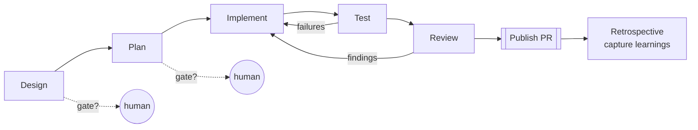
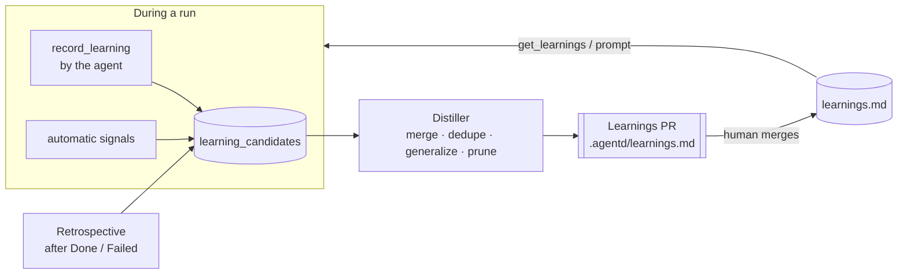

# agentd — Agent Workflow & Learning Loop

Every job runs the same five phases: **Design → Plan → Implement → Test → Review**. Every run
leaves knowledge behind: what worked, what failed, and what the developer answered or corrected.
agentd **captures** it during the run, **distills** it into a curated `learnings.md`, has a human
**approve** the result, and **feeds** it into the matching phase of future runs.

Related: [Architecture](README.md) · [Clean Architecture + BFF](clean-architecture-bff.md) ·
[Messaging](messaging-providers.md) · [UI](../ui/README.md)

---

## 1. The five phases

The pipeline is executed as a **Microsoft Agent Framework workflow**: executors per phase,
conditional edges for the loops, request ports for gates and `ask_developer`, and checkpoints in
PostgreSQL. See [orchestration-maf.md](orchestration-maf.md).



| Phase | Goal | Session | Output artifact | Exit criteria |
|---|---|---|---|---|
| **Design** | understand the work item and the code; choose an approach | main | `design.md`: problem, approach, affected areas, risks, open questions | open questions answered (via `ask_developer`); gate approved if enabled |
| **Plan** | break the approach into ordered, verifiable steps | main | `plan.md`: steps → files → tests to add or change | every acceptance criterion is mapped to a step; gate approved if enabled |
| **Implement** | execute the plan | main | commits on `ai/<id>-<slug>` (at least one per plan step) | all steps done, or the plan amended with a reason |
| **Test** | prove it works | main + agentd | `test-report.md`: commands run, results, new tests | configured verify commands pass (build, tests, lint); otherwise back to Implement, at most `MaxFixLoops` times |
| **Review** | an independent check before a human sees it | **separate reviewer session** (read-only tools) | `review.md`: findings by severity, and verdict | no blocking findings; otherwise back to Implement, at most `MaxReviewLoops` times |

- **Each phase's instructions, artifact template and review checklist come from the repo's
  ai-sdlc kit** (`.agentd/phases/*.md`, `.agentd/templates/*.md`, `.agentd/reviewers/*.md`),
  which is initialized by agentd and customized by the team ([ai-sdlc-kit.md](ai-sdlc-kit.md)).
- Each phase runs on the **model profile** chosen for it ([model-profiles.md](model-profiles.md)), e.g.
  Claude for Design and Plan, a fast model for Implement and Test, and a different family for Review.
- **One main Claude session** runs Design through Test *while the profile stays the same*, so context
  carries across phases. When the profile changes at a phase boundary, a new session starts, seeded
  with the previous phases' artifacts. Review
  uses a **fresh session** with a different system prompt and read-only tools (`Read`, `Grep`,
  `Glob`, `Bash(git diff:*)`). The reviewer judges the diff against `design.md`, `plan.md`, the
  work item's acceptance criteria and the learnings, without the author's reasoning biasing it.
- **Gates** (human approval in chat or the Web UI) are configurable per repo, or per work item with
  the `ai-gate:design` / `ai-gate:plan` tags. Default: a **plan gate on, design gate off**. While a
  gate is open the job is `WaitingForHuman`, and approve/reject arrive as chat options (buttons).
- **Artifacts** are stored in `job_artifacts` (DB) and written to `<worktree>/.agentd-run/`, which is
  listed in `.git/info/exclude` so it is never committed. They are posted to chat as attachments and
  shown in the Web UI.
- **Phase tracking:** the phase is a property of the `Running` state (`Job.Phase`). Transitions
  are `Job.CompletePhase(phase, artifact)`, which raises `phase.started` / `phase.completed` events.

### MCP tools added for the workflow

| Tool | Effect |
|---|---|
| `complete_phase(phase, summary, artifact_markdown, applied_learnings[])` | Stores the artifact and advances the phase; opens a gate if one is configured. `applied_learnings` lists the learning IDs the agent used (§4.4). |
| `record_learning(phase, kind, statement, evidence)` | Records a candidate learning *during* the run, when the insight happens. |
| `get_learnings(phase, paths?)` | Returns the approved learnings relevant to a phase or file paths (§5). |

`finish(...)` is still the final call. It is only accepted after Review has passed.

---

## 2. What counts as a learning

A **learning** is a short, reusable, verifiable rule that would have made a past run faster, cheaper
or more correct. It is not a run log.

| Kind | Example |
|---|---|
| `convention` | "API endpoints live in `src/Agentd.Bff/Endpoints/*Endpoints.cs`, one static class per resource." |
| `command` | "Run integration tests with `dotnet test --project tests/Agentd.Infrastructure.Tests --filter "TestCategory!=Slow"`; the full suite needs Docker." |
| `pitfall` | "EF migrations must be generated from `src/Agentd.Host` (`--startup-project`); from the Persistence project they fail silently." |
| `decision` | "The developer prefers removing legacy endpoints over deprecating them (WI-1234, WI-1302)." |
| `review` | "Human reviewers reject PRs without a test for each acceptance criterion." |
| `workflow` | "For dependency bumps, skip the Design phase; Plan is enough." |

Anti-examples that get discarded: "Fixed the bug in login.ts" (run-specific), "Be careful"
(not actionable), secrets, personal data, and anything copied from untrusted work item text without
confirmation.

---

## 3. Where learnings live

| Scope | File | Versioned in | Approved by |
|---|---|---|---|
| **Repository** | `.agentd/learnings.md` in the target repo | the target repo (via a PR) | the repo's normal PR review |
| **Global** (agentd itself: workflow, tools, prompts) | `<agentd data dir>/learnings/global.md` | agentd DB history + file | the Web UI *Learnings* page or chat |

Keeping repo learnings **in the repo** means they are versioned with the code they describe,
reviewed like code, useful to human developers too, and portable to any other agent tool.

### `learnings.md` format

```markdown
# Learnings — agentd
<!-- Managed by agentd. Edit freely; agentd preserves manual edits and IDs. Budget: ≤ 150 entries. -->

## Design
### L-007 · Check the BFF view model before changing Application read models
- **Kind:** convention · **Paths:** `src/Agentd.Bff/**`, `src/Agentd.Application/**/ReadModels/**`
- **Rule:** UI changes go into BFF view models; only change Application read models when a use case needs new data.
- **Why:** 2 PRs were sent back for leaking UI concerns into Application.
- **Evidence:** WI-1240, WI-1288 · **Confidence:** high · **Seen:** 3 · **Last confirmed:** 2026-09-20

## Plan
...
## Implement
...
## Test
### L-015 · Integration tests need Docker running
- **Kind:** command · **Paths:** `tests/Agentd.Infrastructure.Tests/**`
- **Rule:** Run `docker info` first; if Docker is unavailable, run with `--filter "TestCategory!=Integration"` and say so in the test report.
- **Why:** Testcontainers hangs for 5 min when Docker is down.
- **Evidence:** WI-1251 · **Confidence:** medium · **Seen:** 1 · **Last confirmed:** 2026-09-24

## Review
...
```

Sections map 1:1 to the phases, so each phase loads only its own section, plus any entry whose
`Paths` match the files being touched.

---

## 4. The learning loop



### 4.1 Capture (during the run)

- **Agent-initiated:** the agent calls `record_learning` when it discovers something non-obvious.
  The system prompt tells it when, e.g. "a command failed for an environmental reason", or "you
  searched more than 3 times for where X lives".
- **Automatic signals** are recorded by agentd itself, with no model call:

  | Signal | Candidate |
  |---|---|
  | Test → Implement loop happened | the failing command, the error summary and the fix commit |
  | Reviewer finding fixed | the finding + the fix |
  | Developer answered an `ask_developer` question | the Q&A pair, as a candidate `decision` |
  | Developer rejected a gate | the rejection reason |
  | **Human PR review comments** (polled from ADO after the PR opens) | each comment + the resulting change (the highest-value signal) |
  | Job failed, or hit max turns | the failure reason |
  | Turns or cost far above the repo median | "what took long" (prompted in the retrospective) |

### 4.2 Retrospective (end of the run)

After `Done` (or `Failed`), agentd resumes the **main session** one last time with a retrospective
prompt that includes the automatic signals. The agent returns **structured JSON**, a list of
`{ phase, kind, statement, why, paths, evidence }`. Its tools are limited to `Read` only, and the
retrospective has a small `--max-turns`. For failed jobs this is the most valuable step.

If new PR review comments arrive later, a short **follow-up retrospective** runs when the PR is
completed or abandoned.

### 4.3 Distill (curator)

A `LearningDistillationWorker` runs per repository when **N candidates** have accumulated (default 5)
or on a **schedule** (default: daily), whichever comes first:

1. Load the current `.agentd/learnings.md` from the base branch, plus the pending candidates.
2. Run a **curator Claude session** (no write tools; it outputs structured edits) with these rules:
   - **merge** duplicates, bumping `Seen` and `Last confirmed`, and appending evidence;
   - **generalize** a run-specific statement into a rule, or drop it if it can't be generalized;
   - on a **conflict** with an existing entry, keep the one with newer or stronger evidence and flag
     it in the PR description;
   - **promote** confidence (low → medium → high) as `Seen` grows;
   - **prune**: remove entries not confirmed in 90 days and not cited (§4.4), or keep them with
     `Confidence: stale`;
   - enforce the **budget** (≤ 150 entries, ≤ 25 per phase) by dropping the lowest value first;
   - **never** edit or delete entries a human marked with `<!-- pinned -->`, and preserve manual edits.
3. agentd validates the output (the schema, unique IDs, no secrets by pattern scan, and the size
   budget), renders `learnings.md`, and commits it on the branch `agentd/learnings-<date>`.

### 4.4 Review and apply

- A **Learnings PR** per repository contains the file diff. Its description lists each change
  (added, merged, promoted, pruned) with links to the source runs. It is announced in chat.
- Learnings stay out of feature PRs, so feature reviewers only review feature code.
- Only **merged** learnings are used by later runs. Candidates never affect agents directly.
- **Citations:** agents pass `applied_learnings` in `complete_phase`. A cited learning in a run
  that passed Review counts as a confirmation, while a cited learning in a failed run is flagged
  for the curator. This is how bad learnings get found and pruned.
- **Global learnings** go through the same distiller. Their "PR" is an approval card on the Web UI
  *Learnings* page (and in chat), and history is kept in the DB.

---

## 5. How learnings reach the agent

| Where | What |
|---|---|
| **Phase prompt** | When a phase starts, agentd adds that phase's section, plus the path-matched entries (from the plan's file list), to the phase instructions. The limit is about 2k tokens, highest confidence first. |
| **MCP `get_learnings(phase, paths)`** | on-demand lookup for anything outside the injected slice |
| **Global learnings** | added to the system prompt (`--append-system-prompt`) of every session |
| **Reviewer session** | gets the **Review** section + the **Implement** conventions. The reviewer checks the diff against them, and each violation is a finding. |

Learnings are guidance. The work item, the developer's answers and repo instructions (such as
`CLAUDE.md`) take precedence, and the prompt says so.

---

## 6. Configuration

Per-repo workflow settings (gates, loop limits, verify commands, phase skipping) live in the
repo's **`.agentd/kit.json`** ([ai-sdlc-kit.md §1](ai-sdlc-kit.md#1-kit-layout-in-the-target-repo)).
The agentd config holds only the defaults and the daemon-wide learning settings:

```jsonc
"Workflow": {                                      // defaults when kit.json doesn't say
  "Gates": { "Design": false, "Plan": true },
  "MaxFixLoops": 3,
  "MaxReviewLoops": 2,
  "Reviewer": { "MaxTurns": 40 }                  // model: Models:Routing:*:Review (model-profiles.md)
},
"Learning": {
  "Enabled": true,
  "RepoFile": ".agentd/learnings.md",
  "DistillEveryCandidates": 5,
  "DistillSchedule": "0 3 * * *",
  "PromptBudgetTokens": 2000,
  "MaxEntries": 150,
  "StaleAfterDays": 90
}
```

---

## 7. Data model

| Table | Purpose |
|---|---|
| `job_phases` | `job_id`, `phase`, `started_at`, `completed_at`, `loop_count`, `gate_status`, `summary` |
| `job_artifacts` | `job_id`, `phase`, `kind` (design, plan, test-report, review, retro), `markdown`, `created_at` |
| `learning_candidates` | `id`, `repo`, `scope` (repo/global), `phase`, `kind`, `statement`, `why`, `paths[]`, `evidence jsonb`, `source` (agent/signal/retro/pr-review), `status` (pending/merged/discarded), `distill_run_id` |
| `learning_citations` | `job_id`, `learning_id`, `phase`, `job_outcome` |
| `distill_runs` | `id`, `repo`, `candidate_count`, `pr_url`, `status`, `changes jsonb` |

---

## 8. Where it lives in the solution

| Concern | Layer |
|---|---|
| `Job.Phase`, `CompletePhase`, gate rules, loop limits | Domain |
| `CompletePhase`, `ApproveGate` / `RejectGate`, `RecordLearning`, `RunRetrospective`, `DistillLearnings`, `GetLearnings` use cases; `ILearningStore` port (reads and writes `learnings.md` via Git, candidates via the DB) | Application |
| learnings file parser and renderer, Git branch/PR for the Learnings PR, and ADO PR-comment polling | Infrastructure (Git, AzureDevOps, Persistence) |
| `complete_phase`, `record_learning`, `get_learnings` MCP tools | `Agentd.Mcp` |
| `LearningDistillationWorker`, `PullRequestMonitorWorker` ([pr-reviewer-and-monitor.md](pr-reviewer-and-monitor.md)) | Host workers |
| phase stepper, artifacts, Learnings page, gate approve/reject | `Agentd.Bff` + `web/` |
