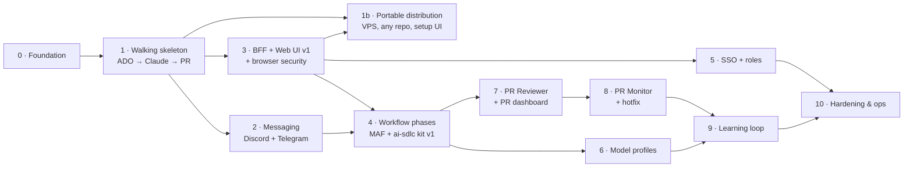

# agentd — Implementation Plan

This plan builds the design in [docs/architect](../architect/README.md) in **11 phases**. Each phase
is a **vertical slice**: it ends with something that runs, and a demo that proves it. Every phase is
reviewed twice, **before** it starts (is this plan the right direction?) and **after** it is built
(does the demo meet the exit criteria?).

---

## Phase overview



| # | Phase | Outcome (the demo) | Size | Plan review | Build review |
|---|---|---|---|---|---|
| 0 | [Foundation](phase-00-foundation/README.md) | Aspire AppHost runs PostgreSQL + Host + Vite; empty green Vue shell and `/healthz`; architecture tests; GitHub Actions CI | M | ☑ approved | ◐ built, awaiting review |
| 1 | [Walking skeleton](phase-01-walking-skeleton/README.md) | Tag a work item `ai-workflow` → Claude works in a worktree → a PR is opened and linked | L | ☐ pending | ☐ |
| 1b | [Portable distribution](phase-01b-portable-distribution/README.md) *(runs after Phase 3)* | On a fresh VPS: `install.sh` → `daemon install` → **web setup wizard** (DB, ADO PAT, SSH key, Claude, repo) → `doctor` all ✅ → tagged work item → PR. Docker Compose works too. | XL | ☐ pending | ☐ |
| 2 | [Messaging](phase-02-messaging/README.md) | The agent asks a question in a Discord thread / Telegram topic; the reply resumes the session | L | ☐ pending | ☐ |
| 2b | [Full job lifecycle in chat](phase-02b-job-lifecycle/README.md) | Clarify → plan (your OK) → implement → verify → PR → review loop until ready → hand-off (knowledge sync PR) → close-out; one thread per work item; every step posted | L | ☐ pending | ☐ |
| 2d | [Brainstorm → work items](phase-02d-brainstorm/README.md) *(after Phase 3)* | `!idea` → read-only brainstorm thread grounded in the code → proposed User Stories + Tasks → created in ADO (optionally started) → close-out | M | ☐ pending | ☐ |
| 3 | [BFF + Web UI v1](phase-03-bff-web-ui/README.md) | Live dashboard and session trace in the browser, under strict CSP and antiforgery | L | ☐ pending | ☐ |
| 4 | [Workflow phases + kit v1](phase-04-workflow-and-kit/README.md) | Jobs run Design → Plan → Implement → Test → Review on MAF, with a plan gate, and survive restarts; `.agentd/` kit init | XL | ☐ pending | ☐ |
| 5 | [SSO + roles](phase-05-sso-and-roles/README.md) | Sign in with Microsoft or Google; Viewer / Operator / Admin enforced in the UI, API and chat | M | ☐ pending | ☐ |
| 6 | [Model profiles](phase-06-model-profiles/README.md) | Implement runs on DeepSeek/GLM, Review on another family; fallback on errors; cost per phase | L | ☐ pending | ☐ |
| 7 | [PR Reviewer + dashboard](phase-07-pr-reviewer/README.md) | `/prs` lists open PRs; pick kit reviewers → findings are posted as PR threads | L | ☐ pending | ☐ |
| 8 | [PR Monitor + hotfix](phase-08-pr-monitor-hotfix/README.md) | A review comment or red CI → agentd pushes a fix and resolves threads; hotfix + backport | L | ☐ pending | ☐ |
| 9 | [Learning loop](phase-09-learning-loop/README.md) | Runs produce candidates → a Learnings PR → merged learnings appear in later prompts | M | ☐ pending | ☐ |
| 10 | [Hardening & ops](phase-10-hardening-ops/README.md) | Kit upgrade, retention, backups, systemd deploy, MAF Harness benchmark, runbook | M | ☐ pending | ☐ |

Sizes are relative (S < M < L < XL), not calendar estimates.

Phase 5 can move **before** Phase 4 if the Web UI must be reachable from anywhere other than
`localhost`. Until SSO ships, agentd refuses to bind to non-loopback addresses.

---

## Folder layout

```
docs/plan/
├── README.md                      # this index
└── phase-NN-<name>/
    ├── README.md                  # the phase plan: goal, scope, exit criteria, open questions
    └── tasks/
        ├── README.md              # task index: ID, dependencies, size, status
        └── NN-<task>.md           # one task: files, implementation steps, tests, done-when checklist
```

Detailed task files exist for **Phases 0–4** (the main workflow). Phases 5–10 have a task index,
and their detail files are written when each phase starts, so they reflect what the earlier phases
actually delivered.

## How each phase is run

1. **Plan review.** You review `phase-NN-*.md`: scope, the out-of-scope list, exit criteria and
   open questions. Changes go into the file, and it is marked ☑ in the table above.
2. **Build** on a branch `phase/NN-<name>`. Small PRs within the phase are fine.
3. **Demo + build review.** The exit criteria are shown working. Tests, the architecture tests and
   the CSP smoke test are green.
4. **Merge.** Anything deferred is noted in the next phase's file.

## Principles for every phase

- **Clean Architecture from day one.** New code goes in the right layer, and the architecture tests
  must stay green ([clean-architecture-bff.md](../architect/clean-architecture-bff.md)).
- **Security isn't a later phase.** Secrets are only in env or user-secrets, agents never get daemon
  secrets, and the browser rules (CSP, antiforgery, HttpOnly) apply from Phase 3 onwards.
- **Each phase leaves the system usable.** No half-finished features on `main`; incomplete work is
  hidden behind a config flag.
- **Tests travel with the code (MSTest on Microsoft.Testing.Platform):** unit tests for Domain and Application, Testcontainers for
  PostgreSQL, recorded fixtures for Azure DevOps, Discord, Telegram and stream-json.
- **Docs stay true.** If the build deviates from `docs/architect`, the design doc is updated in the
  same PR.
