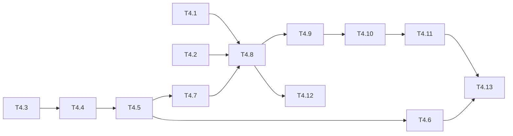

# Phase 4 — Tasks

These are the detailed implementation tasks for [Phase 4 — Workflow phases on MAF + ai-sdlc kit v1](../README.md). Start with T4.1: its go / no-go result decides the MAF APIs used in T4.8–T4.10.

| ID | Task | Depends on | Size | Status |
|---|---|---|---|---|
| T4.1 | [MAF API spike (go / no-go)](01-maf-api-spike.md) | Phase 3 | S | ☐ |
| T4.2 | [Domain: phase model, gates, loop limits, artifacts](02-domain-phase-model.md) | Phase 1 | M | ☐ |
| T4.3 | [Kit v1 content + `kit.v1.json` schema](03-kit-v1-content-and-schema.md) | — | M | ☐ |
| T4.4 | [Kit domain model, layering + `ValidateKit`](04-kit-domain-and-validate.md) | T4.3 | M | ☐ |
| T4.5 | [`IKitStore` + `LoadKitForJob` (base-branch snapshot, `RequireKit`)](05-kit-store-and-load-for-job.md) | T4.4 | M | ☐ |
| T4.6 | [`InitKit` + bootstrap run + Kit PR](06-init-kit-and-bootstrap.md) | T4.3, T4.5 | L | ☐ |
| T4.7 | [Phase prompt builder](07-phase-prompt-builder.md) | T4.2, T4.5 | M | ☐ |
| T4.8 | [MAF workflow graph + executors](08-maf-workflow-and-executors.md) | T4.1, T4.2, T4.5, T4.7 | L | ☐ |
| T4.9 | [PostgreSQL checkpoint store + workflow versioning](09-postgres-checkpoint-store.md) | T4.1, T4.8 | M | ☐ |
| T4.10 | [`JobWorkflowHost`: run, release, rehydrate, recover + event mapping](10-job-workflow-host.md) | T4.8, T4.9 | L | ☐ |
| T4.11 | [MCP `complete_phase`, gated `finish`, chat gate buttons & artifacts](11-mcp-and-chat-gates.md) | T4.2, T4.10 | M | ☐ |
| T4.12 | [Guardrails: deny `.agentd/**` and protected paths](12-guardrails-protected-paths.md) | T4.5, T4.8 | S | ☐ |
| T4.13 | [UI: phase stepper, Artifacts tab, gate buttons, Repos page](13-ui-phases-artifacts-repos.md) | T4.6, T4.10, T4.11 | M | ☐ |

