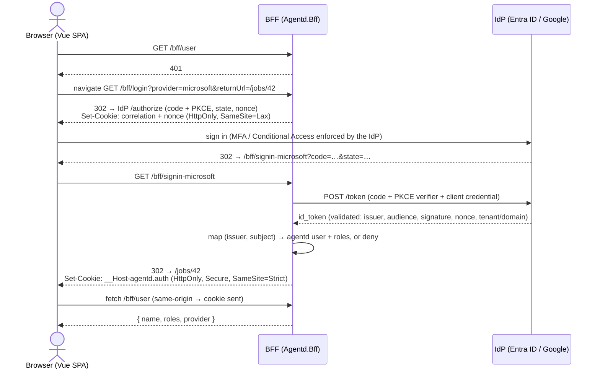

# agentd — Authentication & Authorization (SSO)

The Web UI signs in with **SSO through Microsoft (Entra ID) or Google**, using **OpenID Connect**.
The whole protocol runs **server-side in the BFF**: the Vue app never sees a token and never loads
IdP JavaScript. It only holds an HttpOnly session cookie.

Related: [Web Security (cookies, antiforgery, CSP)](README.md) · [Clean Architecture + BFF §5.1](../architect/clean-architecture-bff.md#51-agentdbff-backend-for-frontend-browser) · [UI](../ui/README.md)

---

## 1. Flow



- **Authorization Code + PKCE, confidential client.** The BFF authenticates to the IdP with a
  client secret, or preferably a certificate or federated credential for Entra. Nothing sensitive
  touches the browser.
- **`ResponseMode = query`**, so the callback is a GET redirect. The correlation and nonce cookies
  can then stay `SameSite=Lax`. With `form_post` they would need `SameSite=None`.
- **Why the `Strict` session cookie still works:** the callback sets the session cookie and
  redirects to the SPA. That first HTML load comes from a cross-site redirect chain, so the
  `Strict` cookie is not sent with it, but it doesn't need to be because the page is static. Every
  following SPA `fetch` and SignalR call is same-origin, so the cookie is sent.
- **No tokens are kept.** With `SaveTokens = false`, agentd does not call Graph or Google APIs on
  the user's behalf. The ID token is used once to establish identity and then discarded, which keeps
  the cookie small.

---

## 2. Providers

| | Microsoft (Entra ID) | Google |
|---|---|---|
| Authority | `https://login.microsoftonline.com/{tenantId}/v2.0` (**single tenant**; never `/common` without strict issuer validation) | `https://accounts.google.com` |
| Callback | `/bff/signin-microsoft` | `/bff/signin-google` |
| Stable user key | `tid` + `oid` (not email) | `sub` |
| Restrict who can sign in | the tenant, plus **"Assignment required"** on the Enterprise App (only assigned users or groups) | the `hd` claim must be in `AllowedHostedDomains` (Workspace), and `email_verified` must be `true`. Check `hd` **server-side**; the `hd` request parameter is only a hint. |
| Roles | **Entra app roles** (`Viewer`, `Operator`, `Admin`) → `roles` claim, or the agentd user directory | agentd user directory |
| MFA | enforced by Conditional Access. Optionally require `amr` to contain `mfa` for Admin actions. | enforced by Workspace 2-Step Verification policy |
| Credential | a certificate or federated credential (preferred), or a client secret | a client secret |

Each provider is its own OIDC scheme with its own callback path, and the issuer is validated per
scheme. This prevents mix-ups between the two IdPs. More OIDC providers (Okta, Keycloak, GitHub
via an OIDC bridge, …) can be added as schemes without code changes elsewhere.

**Discord OAuth is no longer used for Web UI login.** Discord remains a *messaging* provider.

---

## 3. Server configuration

```csharp
builder.Services
    .AddAuthentication(o =>
    {
        o.DefaultScheme = CookieAuthenticationDefaults.AuthenticationScheme;
        o.DefaultChallengeScheme = "microsoft";
    })
    .AddCookie(o =>
    {
        o.Cookie.Name = "__Host-agentd.auth";
        o.Cookie.HttpOnly = true;
        o.Cookie.SecurePolicy = CookieSecurePolicy.Always;
        o.Cookie.SameSite = SameSiteMode.Strict;
        o.SlidingExpiration = true;
        o.ExpireTimeSpan = auth.Session.IdleTimeout;                  // e.g. 8h idle
        o.Events.OnRedirectToLogin = ctx => { ctx.Response.StatusCode = 401; return Task.CompletedTask; };
        o.Events.OnRedirectToAccessDenied = ctx => { ctx.Response.StatusCode = 403; return Task.CompletedTask; };
        o.Events.OnValidatePrincipal = SessionValidator.ValidateAsync; // revocation, absolute lifetime, user still active
    })
    .AddOpenIdConnect("microsoft", o =>
    {
        o.Authority = $"https://login.microsoftonline.com/{ms.TenantId}/v2.0";
        o.ClientId = ms.ClientId;
        // o.ClientSecret = …  or a client assertion (certificate) via o.Events.OnAuthorizationCodeReceived
        o.ResponseType = OpenIdConnectResponseType.Code;
        o.UsePkce = true;
        o.ResponseMode = OpenIdConnectResponseMode.Query;
        o.CallbackPath = "/bff/signin-microsoft";
        o.Scope.Clear(); o.Scope.Add("openid"); o.Scope.Add("profile"); o.Scope.Add("email");
        o.SaveTokens = false;
        o.MapInboundClaims = false;
        o.TokenValidationParameters.ValidIssuer = $"https://login.microsoftonline.com/{ms.TenantId}/v2.0";
        o.Events.OnTokenValidated = ctx => ctx.HttpContext.RequestServices
            .GetRequiredService<ExternalLoginMapper>().MapAsync(ctx, provider: "microsoft");
    })
    .AddOpenIdConnect("google", o =>
    {
        o.Authority = "https://accounts.google.com";
        o.ClientId = g.ClientId;
        o.ClientSecret = g.ClientSecret;
        o.ResponseType = OpenIdConnectResponseType.Code;
        o.UsePkce = true;
        o.CallbackPath = "/bff/signin-google";
        o.Scope.Clear(); o.Scope.Add("openid"); o.Scope.Add("profile"); o.Scope.Add("email");
        o.SaveTokens = false;
        o.MapInboundClaims = false;
        o.Events.OnTokenValidated = ctx => ctx.HttpContext.RequestServices
            .GetRequiredService<ExternalLoginMapper>().MapAsync(ctx, provider: "google");
    });

// Data Protection keys in PostgreSQL, so sessions survive restarts and deploys.
builder.Services.AddDataProtection()
    .SetApplicationName("agentd")
    .AddKeyManagementOptions(o => o.XmlRepository =
        sp.GetRequiredService<PostgresXmlRepository>());   // IXmlRepository over agentd.dp_key_* routines
```

### BFF session endpoints

```csharp
var bff = app.MapGroup("/bff").AddEndpointFilter<ValidateAntiforgeryFilter>();

bff.MapGet("/login", (string provider, string? returnUrl, IOptions<AuthOptions> auth) =>
    auth.Value.IsEnabled(provider)
        ? Results.Challenge(new() { RedirectUri = LocalUrl.OrRoot(returnUrl) }, [provider])   // open-redirect safe
        : Results.BadRequest());

bff.MapPost("/logout", async (HttpContext ctx, ISessionStore sessions) =>
{
    await sessions.RevokeAsync(ctx.User.SessionId());
    await ctx.SignOutAsync(CookieAuthenticationDefaults.AuthenticationScheme);
    return Results.Ok(new { redirect = "/" });          // local sign-out; the IdP session is untouched
});

bff.MapGet("/user", (ClaimsPrincipal user) => user.Identity?.IsAuthenticated == true
    ? Results.Ok(new { name = user.Name(), roles = user.Roles(), provider = user.Idp() })
    : Results.Unauthorized());

bff.MapGet("/providers", (IOptions<AuthOptions> auth) => auth.Value.EnabledProviders()); // for the login page buttons
```

- `returnUrl` must be a **local path** (`LocalUrl.OrRoot` rejects absolute and protocol-relative
  URLs), which prevents open redirects.
- OIDC `state`, `nonce` and the correlation cookie (built into ASP.NET Core) prevent login CSRF and
  replay. PKCE prevents authorization-code injection.
- Logout is a local sign-out by default. Signing out of the IdP too is optional: the BFF returns the
  IdP's end-session URL and the SPA navigates to it, because `fetch` cannot follow a cross-origin
  redirect.

---

## 4. Users, identities and roles

A single **user directory** serves both web login and chat, so a person has one agentd identity
wherever they act:

```jsonc
"Users": [
  {
    "Name": "tngo",
    "Email": "tngo@example.com",
    "Roles": ["Admin"],
    "Identities": { "Discord": "789...", "Telegram": "123456789",     // chat identities
                    "AzureDevOps": "tngo@example.com" }             // ADO identity: authorizes PR comments to trigger fixes
  }
]
```

- The config **seeds** the PostgreSQL tables `users` and `user_identities`
  (`provider`, `issuer`, `subject` → `user_id`).
- **Linking an SSO identity:** on first SSO login, if no identity row matches `(issuer, subject)`,
  agentd links it to the user whose `Email` equals the token's **verified** email. For Google that
  means `email_verified = true`. For Entra, the tenant must be single-tenant and managed by you.
  From then on only `(issuer, subject)` is used, so a later email change can't take over an account.
- **Unknown users are denied** (`access_denied` → the login page shows "not authorized"), unless
  `AutoProvision` is enabled. With it on, anyone from the allowed tenant or domain gets the
  `DefaultRole` (e.g. `Viewer`).
- `ExternalLoginMapper` **replaces** the IdP claims with a minimal agentd principal: `sub`
  (agentd user ID), `name`, `role`, `idp` and `sid` (the session ID). The cookie stays small, and no
  IdP data is kept beyond it.
- **Role source:** `Directory` (default) or `EntraAppRoles` for Microsoft, where the token's `roles`
  claim is authoritative and maps directly to agentd roles.

### Roles and policies

| Role | Web UI / API | Chat |
|---|---|---|
| `Viewer` | dashboards (incl. the PR dashboard), traces, diffs, history, learnings, review results; SignalR subscribe | `status`, `logs`, `list` |
| `Operator` | + message agents, approve or reject gates, cancel, retry, run a work item; **run PR reviews, fix now, toggle PR monitoring, create hotfixes** | + reply to agents, `cancel`, `retry`, `run`, `review`, `fix`, `monitor`, `hotfix` |
| `Admin` | + repositories and kit init/upgrade, model profiles, users, approve global learnings | + `init <repo>` |

```csharp
builder.Services.AddAuthorizationBuilder()
    .AddPolicy("Viewer",   p => p.RequireAuthenticatedUser().RequireRole("Viewer", "Operator", "Admin"))
    .AddPolicy("Operator", p => p.RequireRole("Operator", "Admin"))
    .AddPolicy("Admin",    p => p.RequireRole("Admin"));

api.MapGet("/dashboard", …).RequireAuthorization("Viewer");
api.MapPost("/jobs/{id}/cancel", …).RequireAuthorization("Operator");
api.MapPost("/repos/{name}/kit/init", …).RequireAuthorization("Admin");
app.MapHub<EventsHub>("/hubs/events").RequireAuthorization("Viewer");
```

Chat commands go through the same roles in `HandleInboundMessage`, so a Viewer's chat reply never
reaches an agent.

---

## 5. Sessions

- **Idle timeout** is 8 hours (sliding) and the **absolute lifetime** is 7 days. Both are
  configurable, and after either expires the user signs in again.
- A server-side **`user_sessions`** row (`sid`, `user_id`, `idp`, `created_at`, `last_seen_at`,
  `revoked_at`) backs every cookie. `OnValidatePrincipal` checks it every 5 minutes, so **revoking a
  session or disabling a user takes effect within minutes** and does not have to wait for cookie
  expiry. Admins can see and revoke sessions on the Users page.
- Data Protection keys live in PostgreSQL, and the default key rotation (90 days) is kept.
- The antiforgery request token is bound to the user. The SPA refetches `/bff/antiforgery` after
  login and logout ([README §2](README.md#2-cookies-and-antiforgery)).

---

## 6. Modes and deployment

```jsonc
"Auth": {
  "Mode": "Sso",                                   // None | CloudflareAccess (T3.14) | Sso
  "Providers": {
    "Microsoft": { "Enabled": true, "TenantId": "…", "ClientId": "…", "RoleSource": "Directory" },
    "Google":    { "Enabled": true, "ClientId": "…", "AllowedHostedDomains": ["example.com"] }
  },
  // secrets: Agentd__Auth__Providers__Microsoft__ClientSecret (or certificate), Agentd__Auth__Providers__Google__ClientSecret
  "Session": { "IdleTimeout": "08:00:00", "AbsoluteLifetime": "7.00:00:00" },
  "AutoProvision": { "Enabled": false, "DefaultRole": "Viewer" }
}
```

- **`Mode: None`** is for a single developer on their own machine. The **daemon refuses to start**
  in this mode unless the web server is bound to a loopback address, so it fails closed.
  Antiforgery and CSP stay on.
- **`Mode: None` never trusts proxied requests.** A request carrying `X-Forwarded-For`,
  `Cf-Connecting-IP` or similar is rejected, even though the proxy connects from loopback.
- **`Mode: CloudflareAccess`** (T3.14, before Phase 5) publishes the UI through Cloudflare Tunnel.
  Cloudflare Access signs the user in at its edge, and agentd validates the `Cf-Access-Jwt-Assertion`
  JWT on every request: Cloudflare's signing keys, the issuer and the application's audience. The
  user is the token's email. There's no loopback exemption in this mode, and `/mcp` is never routed
  through the tunnel ([deployment.md §7.1](../architect/deployment.md#71-publishing-the-web-ui-with-cloudflare-tunnel--access)).
- **`Mode: Sso`** is required for any non-loopback binding. The IdPs require **HTTPS** redirect URIs
  (except for `localhost`), so remote access goes through a TLS reverse proxy or a tunnel. Behind the
  proxy, configure `ForwardedHeaders` with `KnownProxies` so the generated redirect URIs use
  `https` and the public host.
- App registrations:
  - **Entra:** a Web platform app with redirect URI `https://<host>/bff/signin-microsoft`,
    single-tenant, "Assignment required", optional app roles `Viewer` / `Operator` / `Admin`, and a
    certificate credential.
  - **Google:** an OAuth client of type "Web application" with redirect URI
    `https://<host>/bff/signin-google`, and an **Internal** consent screen for Workspace.

---

## 7. Web UI

- The **`/login` page** shows one button per enabled provider (from `/bff/providers`). Each button
  is a plain link to `/bff/login?provider=…&returnUrl=…`.
  - The buttons are our own components, following each vendor's branding guidelines, with **static
    SVG logos**. No Google Identity Services script and no MSAL.js are loaded, so the CSP stays
    `script-src 'self'`.
- The `session` store calls `/bff/user` on startup. On a 401, the router redirects to `/login` with
  `returnUrl`, and an `?error=access_denied` query shows "Your account isn't authorized for
  agentd".
- UI elements are shown or hidden by role (e.g. Operator actions). **The server enforces every
  policy regardless**, because the UI checks are only for convenience.

---

## 8. Threats covered

| Threat | Mitigation |
|---|---|
| Token theft from the browser | no tokens in the browser; HttpOnly cookie only |
| Login CSRF / code injection | OIDC `state` + `nonce` + correlation cookie; PKCE |
| IdP mix-up | one scheme and callback path per IdP; per-scheme issuer validation |
| Open redirect via `returnUrl` | local paths only |
| Other Entra tenants or other Google accounts | single-tenant authority + assignment required; `hd` + `email_verified` checks |
| Account takeover through email reuse | linking by verified email happens only once; after that, `(issuer, subject)` only |
| Stolen cookie outliving a revocation | server-side session check every 5 minutes; absolute lifetime |
| Unauthenticated remote exposure | `Mode: None` only on loopback; startup fails closed |
